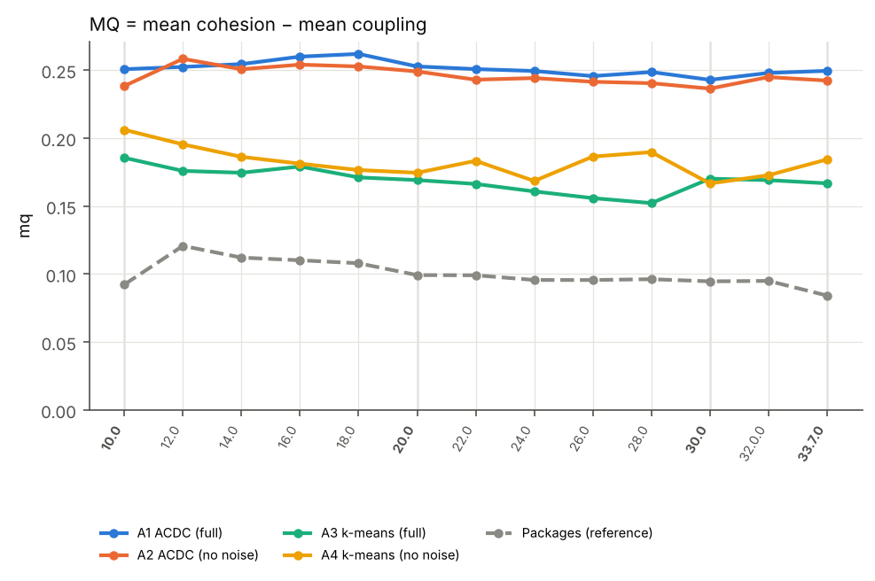

> Code and data: GitHub repository `epl484.fall26.project1.teamX`, folder
> `guava/` (data in `guava/data/`, results in `guava/results/`, AI material in
> `guava/ai/`, report in `guava/report/`); the analysis scripts are in
> `scripts/`. Every table in this report is generated from the result files
> by `scripts/report_tables.py`.

# 1. Project choice and characteristics

## 1.1 What is Guava?

[Guava](https://github.com/google/guava) is Google's set of core libraries
for Java. It is used in most Java projects inside Google and in a large part
of the Java ecosystem. It offers:

* **Collections** – immutable collections (`ImmutableList`, `ImmutableMap`,
  ...), new collection types (`Multimap`, `Multiset`, `BiMap`, `Table`),
  ranges (`Range`, `RangeSet`), and utilities (`Lists`, `Maps`, `Sets`,
  `Iterables`, `FluentIterable`, `Ordering`);
* **Base utilities** – `Preconditions`, `Optional`, functional types, string
  handling (`Joiner`, `Splitter`, `CharMatcher`), `Stopwatch`;
* **Concurrency** – `ListenableFuture` and the `Futures` combinators,
  executors, `Service`, `RateLimiter`;
* **Caching** (`CacheBuilder`, `LoadingCache`), a **graph library** (`Graph`,
  `ValueGraph`, `Network`), **I/O** (`ByteSource`, `CharSource`, `Files`),
  **hashing** (`Hashing`, `BloomFilter`), **primitives and math**,
  **reflection** (`TypeToken`, `ClassPath`), an **event bus**, **escaping** and
  **networking** helpers (`MediaType`, `InternetDomainName`).

Guava is a **library**: it has no runtime architecture of its own, so its
architecture is its static decomposition into packages and classes and
the dependencies between them.

## 1.2 Eligibility (Phase 1)

| Criterion | Guava |
|---|---|
| ≥ 10 major/minor versions | **54 major/minor releases** (33 major v1.0–v33.0, 21 minor), plus 28 patch releases and 25 release candidates (109 `v*` tags) |
| Repository on GitHub | `google/guava` |
| Latest version ≥ 10K LOC | 33.7.0: 611 production `.java` files, **96,646 non-comment, non-blank LOC** |
| Not archived / not a fork | ✔ / ✔ |
| ≥ 50 commits since 1/1/2024 | **1,261** (of 7,546) |
| Created before 2024 | history starts 2009-06-18 |

## 1.3 Number and size of versions

We analyse a **sparse sample of 13 releases**: every second major release
from 10.0 to 32.0 plus the latest feature release 33.7.0. This covers 15
years (September 2011 – August 2026), and no two sampled releases are
consecutive. Table 1 gives the size of each version. *Class files* include
inner and anonymous classes. *Top-level classes* are compilation units.
*Dependencies* are distinct dependencies between top-level classes.

Table 1 – Size of the analysed versions.

| Version | Date | Packages | Class files | Top-level classes | Δ classes | Dependencies | Deps/class |
|---|---|---|---|---|---|---|---|
| 10.0 | 2011-09-27 | 10 | 1157 | 317 | – | 1289 | 4.16 |
| 12.0 | 2012-04-30 | 13 | 1332 | 373 | +17.7% | 1597 | 4.39 |
| 14.0 | 2013-02-25 | 13 | 1584 | 412 | +10.5% | 1945 | 4.87 |
| 16.0 | 2014-01-17 | 17 | 1663 | 448 | +8.7% | 2121 | 4.88 |
| 18.0 | 2014-08-25 | 17 | 1677 | 454 | +1.3% | 2112 | 4.81 |
| 20.0 | 2016-10-28 | 18 | 1799 | 514 | +13.2% | 2453 | 4.92 |
| 22.0 | 2017-05-22 | 18 | 1850 | 529 | +2.9% | 2534 | 4.93 |
| 24.0 | 2018-02-01 | 18 | 1922 | 549 | +3.8% | 2633 | 4.93 |
| 26.0 | 2018-08-01 | 18 | 1936 | 556 | +1.3% | 2686 | 4.96 |
| 28.0 | 2019-06-11 | 18 | 1932 | 554 | -0.4% | 2699 | 5.01 |
| 30.0 | 2020-10-16 | 18 | 2010 | 569 | +2.7% | 2769 | 5.01 |
| 32.0.0 | 2023-05-26 | 18 | 1997 | 607 | +6.7% | 2821 | 5.06 |
| 33.7.0 | 2026-08-17 | 18 | 1948 | 594 | -2.1% | 2750 | 4.96 |

## 1.4 Is the architecture documented?

Only at the API level. The README and the
[user guide](https://github.com/google/guava/wiki) describe the packages
feature by feature ("Collections", "Caches", "Functional idioms",
"Concurrency", "Strings", "Primitives", "Ranges", "I/O", "Hashing",
"EventBus", "Math", "Reflection", "Graphs"), and the Javadoc documents each
package. The wiki also documents policies with architectural consequences:
a strict **API-compatibility** policy, where `@Beta` APIs may change and the
rest are only removed after deprecation, and the separate **JRE and
Android flavours**. There is **no component/dependency view** and no
description of the internal structure of the large packages. The package
structure *is* the documented architecture.

# 2. Methodology

The analysis scripts are in `scripts/`; the Guava-specific data collection is
in `guava/scripts/`.

```
GitHub tags ─► sparse selection ─► Maven Central jar ─► com/google/** classes
                                                           │
                       ┌───────────────────────────────────┤
                       ▼                                   ▼
          DependencyExtractor.jar                       JNode.jar
          class dependencies (csv)                noise classes (csv)
                       └──────────► top-level class graph ◄┘
                                full graph        graph without noise
                              ACDC(A1) k-means(A3)  ACDC(A2) k-means(A4)
                                  └─ cohesion · coupling · MQ · MoJoFM ─┘
```
*Figure 1 – Analysis pipeline.*

## 2.1 Data collection

1. **Releases.** All tags were read from a blob-less clone of the repository
   with their creation dates (`guava/data/tags.csv`). The Phase 1 statistics
   come from the same clone (commit counts, NCLOC of `guava/src` at
   `v33.7.0`).
2. **Binaries.** Guava is a single Maven artifact (`com.google.guava:guava`).
   `guava/scripts/collect_versions.py` downloads the jar of every selected
   release from Maven Central. From 23.1 on Guava is published in two flavours
   (`-jre`, `-android`); we use the main **`-jre`** flavour. The script keeps
   the `com/google/**` classes (Guava's own code, including
   `com.google.thirdparty.publicsuffix`) and places the jar in
   `guava/data/workspace/<v>/bin/`, the input layout of the course tools.

## 2.2 Data cleaning and version selection

* **Population.** The major/minor releases from 10.0 on. Before 10.0 Guava
  used the `r01…r09` numbering, and 10.0 is its first release with the
  current scheme.
* **Excluded releases.** Patch releases (x.y.z, z > 0), release candidates
  (`-rc`) and two special tags (`13.0-final`, `15.0-cdi1.0`).
* **Sparse sample.** Every second major release (10, 12, …, 32) and the latest
  release 33.7.0: **13 versions**. The time gaps vary from 6 months to
  3 years (Table 1) because Guava's release rate slowed down after 2020; the
  version axis of all figures is ordinal, not time-proportional.
* **Excluded classes.** `module-info`/`package-info`; inner/anonymous classes
  are folded into their top-level class. 5–10 classes per version have no
  dependency to or from another Guava class (e.g. `Charsets`, `Flushables`,
  `Runnables`, which only use JDK types) and are left out of A1–A4.

## 2.3 Tools

| Step | Tool / library |
|---|---|
| Class dependencies (3.2) | Course **DependencyExtractor.jar** |
| Widely-used classes (3.3) | Course **JNode.jar** (Constantinou et al. 2015), with two documented patches (`tools/JNode-fast-p4.jar`, see below) |
| ACDC (A1, A2) | ACDC (Tzerpos & Holt), Java port from USC **ARCADE** (`tools/acdc.jar`); the York download link was not reachable |
| k-means (A3, A4) | **scikit-learn** `KMeans` (as suggested in the tutorial) |
| MoJoFM | Original **MoJo 2.0** implementation (`tools/mojo.jar`) |
| Metrics, plots | Python 3.13 (numpy, scipy, networkx, matplotlib) |

**JNode patches.** JNode needed more than two hours for one Guava version and
did not work for the larger versions, so we decompiled it and changed three
methods (`tools/jnode-patch/`):

1. *Performance.* A class-name lookup that scanned the whole class list on
   every step of the subgraph extraction, and a set-membership test written as
   a loop, were replaced by hash lookups. The output of the patched tool is
   **byte-identical** to the original on Guava 10.0 and 12.0
   (`guava/data/noise_original/`).
2. *Precision.* JNode starts every class weight (step 1 of the method) at
   `round(1/n, 3)`. For **more than 2,000 class files** this rounds to **0**.
   All path weights then become 0, every SIG is normalised to 0, and no class
   is flagged. This happens for Guava **30.0 (2,010 class files)**. We therefore
   round to 4 decimals. On the other 12 versions the noise sets of both
   variants are compared in Table 3 (`guava/data/noise_jnode3/`).

**JNode threshold.** JNode flags a class if its normalised SIG ≥ mean + 1σ
(Lecture 6–7, step 4). For 10.0 and 12.0 this limit (1.010 and 1.023) lies
above the maximum SIG (1.0), so no class is flagged. For these two versions we
use the maximum SIG as the limit.

**ACDC naming.** ACDC names a subsystem after the base name of its dominator
(text before the last dot), which for Java class names is the package, so all
subsystems of a package would be merged in the output. We give ACDC
file-style names (`pkg.Class.java`) and remove the suffix from the output.

## 2.4 Architecture recovery (A1–A4)

`scripts/recover.py` builds the dependency graph of the top-level classes of
each version and writes the ACDC input (`guava/data/rsf/<v>_full.rsf` and
`_nonoise.rsf`, one `depends A B` line per dependency). It then recovers:

* **A1 / A2** – ACDC on the full graph / on the graph without the classes
  flagged by JNode;
* **A3 / A4** – k-means on the full graph / on the graph without them;
* **PKG** – the developers' package structure, used as reference.

*Features for k-means.* k-means needs a vector per class. Each class is
described by its dependency profile (the classes it uses, the classes that
use it, and itself), normalised and reduced to 64 dimensions, so that classes
with similar dependencies are close to each other.

*Number of clusters.* For every version and both graphs we ran k-means for
k = 4 … n/3 and chose k with the **elbow method**: the point where the
within-cluster sum of squares (inertia) stops falling steeply (Figure 2). This
gives clusters of 6–9 classes on average. k grows from 52 (A3) / 42 (A4) in
10.0 to 69 / 64 in 33.7.0.


## 2.5 Evaluation

All measures are those of Lectures 1–2, 5 and 6–7.

* **Cohesion** Aᵢ = μᵢ / Nᵢ² (μᵢ dependencies inside cluster i, Nᵢ classes).
  The lecture allows μᵢ/Nᵢ² or μᵢ/(Nᵢ(Nᵢ−1)). We use Nᵢ² because it is defined
  for one-class clusters.
* **Coupling** Eᵢⱼ = εᵢⱼ / (2·Nᵢ·Nⱼ) (εᵢⱼ dependencies between clusters i and j).
* **MQ (Modularization Quality)** = (1/k)·ΣAᵢ − (2/(k(k−1)))·ΣEᵢⱼ, in [−1, 1].
* **MoJoFM**(A, R) = (1 − mno(A,R) / max mno(·,R)) · 100 %, where mno is the
  minimum number of Move and Join operations that turn architecture A into
  reference R. Guava has no expert architecture, so the references are the
  **package structure** (every version) and the **AI architecture** of
  Phase 4 (33.7.0). MoJoFM between the architectures of consecutive versions
  shows how much the architecture changes (**stability**).
* **Widely-used classes:** JNode and, for comparison, the **Bunch** rule
  (in-degree > 3 × average in-degree), each followed by ACDC as in the
  lecture's comparison of "System", "Noise" and "Bunch".
* **Architectural smells** (Lecture 5), per version and normalised by the
  number of classes or packages: *cyclic dependency* (packages/classes in a
  dependency cycle, found with depth-first search), *hub-like dependency*
  (fan-in and fan-out above the medians and |in − out| < 0.25·(in + out)),
  *unstable dependency* (package that depends on a less stable package,
  instability I = Ce/(Ca+Ce)) and *god component* (package with more classes
  than mean + 2σ of the package sizes – the lecture leaves the threshold open).
* **Lehman's laws** (Lecture 1–2): size, dependencies, dependencies added and
  removed per version (as in the lecture's Eclipse example), and commits per
  month between the analysed releases.

# 3. Results and discussion

## 3.1 Size


Guava grew from **317 to 594 top-level classes (+87 %)** and from 1,157 to
1,948 class files over 15 years. Growth is concentrated in the first five
years:

* **10.0 → 20.0 (2011–2016): +62 %.** New packages were added: `hash`, `math`
  and `reflect` in 12.0; `escape`, `html`, `xml` and the public-suffix list in
  16.0; and the `graph` library in 20.0 (+76 classes). The number of
  packages grew from 10 to 18.
* **20.0 → 32.0 (2016–2023): +18 %**, without new packages. The changes are
  additions to existing packages, mainly Java 8 support between 20.0 and 24.0
  (`Streams`, `MoreCollectors`, `CollectSpliterators`, `FluentFuture`,
  `MoreFiles`, `ImmutableIntArray`) and graph traversal (`Traverser`).
* **32.0 → 33.7 (2023–2026): −2 %.** 14 classes were added and 18 removed
  (Table 9). The library is now in maintenance mode.

**Lehman's laws.** *Continuing change (I)* holds: every sampled release
changes classes (Table 9). *Continuing growth (VI)* holds, but the rate falls
strongly over time. Since 20.0 no sampled release added more than 5 % new
classes, which is consistent with *conservation of familiarity (V)*: the
size of the changes between releases stays small and bounded. Guava's
compatibility policy reinforces this: public API can only be removed after
deprecation, and new API must fit an existing package.

## 3.2 Class dependencies


Dependencies grew from **1,289 to 2,750 (×2.1)**, faster than the classes
(×1.8). The density rose from **4.2 to 5.1 dependencies per class** (peak
in 32.0.0) and never decreases. This is a clear case of *increasing
complexity (II)*. New features are built on top of the existing collection
and base APIs, so each new class adds dependencies to a dense core.

## 3.3 Widely-used (noise) classes

Table 3 – Widely-used classes (JNode) per version, and comparison of the
original (3-decimal) and fixed (4-decimal) JNode.

| Version | Connected classes | Isolated | Noise (top-level) | Noise % | Fallback |
|---|---|---|---|---|---|
| 10.0 | 302 | 8 | 24 | 7.95% | yes |
| 12.0 | 354 | 10 | 15 | 4.24% | yes |
| 14.0 | 390 | 9 | 48 | 12.31% |  |
| 16.0 | 425 | 10 | 58 | 13.65% |  |
| 18.0 | 429 | 10 | 58 | 13.52% |  |
| 20.0 | 491 | 8 | 68 | 13.85% |  |
| 22.0 | 506 | 8 | 73 | 14.43% |  |
| 24.0 | 527 | 7 | 75 | 14.23% |  |
| 26.0 | 535 | 6 | 75 | 14.02% |  |
| 28.0 | 533 | 6 | 75 | 14.07% |  |
| 30.0 | 547 | 6 | 82 | 14.99% |  |
| 32.0.0 | 553 | 5 | 68 | 12.3% |  |
| 33.7.0 | 549 | 5 | 77 | 14.03% |  |


JNode flags **15–82 top-level classes (4–15 %)**. Most of them are what the
lecture calls omnipresent classes, but not all:

* In 33.7.0, **43 of the 48 classes of `common.base`** are flagged
  (`Preconditions`, `Function`, `Predicate`, `Optional`, `CharMatcher`, ...).
  These are utility classes used by almost every other package, as expected.
* **18 of the 19 classes of `common.cache` are also flagged**, although the
  cache is used by only one other package (`eventbus`, 3 dependencies). The
  cache depends on base, collect and concurrency, so in JNode's step 2 it lies
  on many paths of the subgraphs it belongs to and gets a high significance.
  It is "significant" but not "widely used".
* Core collection classes such as `Iterators`, `Ordering`, `Multiset`,
  `ImmutableCollection`, `Lists` and `Sets` are **not** flagged, although the
  Bunch rule (3.7) identifies them as omnipresent.

## 3.4 Recovered architectures (A1–A4)

Table 4 – Mean over the 13 versions.

| Architecture | k | Largest cluster | Cohesion | Coupling | MQ | MoJoFM to packages (%) |
|---|---|---|---|---|---|---|
| A1 ACDC (full) | 78 | 46 | 0.2578 | 0.00649 | 0.2513 | 70.9 |
| A2 ACDC (no noise) | 69 | 38 | 0.2506 | 0.00481 | 0.2458 | 74.5 |
| A3 k-means (full) | 60 | 31 | 0.1756 | 0.00662 | 0.1690 | 73.9 |
| A4 k-means (no noise) | 52 | 18 | 0.1865 | 0.00408 | 0.1824 | 80.2 |
| Packages (full) | 15 | 205 | 0.1053 | 0.00503 | 0.1003 | – |
| Packages (no noise) | 14 | 196 | 0.1161 | 0.00363 | 0.1125 | – |




**Size.** ACDC produces 41 (10.0) to 90–96 clusters (30.0–33.7.0), with a
largest cluster of 27–52 classes. k-means produces 40–74 clusters of at most
43 classes. The packages are very coarse: 8–17 groups, the largest being
`common.collect` with 179–217 classes.

**Quality (MQ).** ACDC has the highest MQ in every version (mean 0.251 for
A1, 0.246 for A2), k-means follows (0.169 / 0.182), and the package structure
is last (0.100). Coupling is small for all of them (0.004–0.007), so MQ is
decided by cohesion: ACDC's clusters of 6–7 classes are dense (cohesion
0.258), k-means' slightly larger ones less so (0.176), and the packages,
with `common.collect` (~200 classes) as one group, have the lowest cohesion
(0.105). By the course's measure, the **recovered architectures are better
modularised than the package structure**: ACDC finds dense groups of
collaborating classes inside the large packages (e.g. `Multimaps.ss`, the
multimap implementations and their utilities; `Hashing.ss`, the hash
functions).

* **ACDC vs k-means.** ACDC has the higher cohesion and MQ in every version,
  and the lower coupling in 7 of the 13 versions (33.7.0: 0.0048 vs 0.0096).
* **Removing the widely-used classes** (A1→A2, A3→A4) **lowers the coupling
  clearly** (ACDC 0.0065 → 0.0048, k-means 0.0066 → 0.0041). Classes such as
  `Preconditions`, used by almost every cluster, no longer connect the
  clusters. MQ changes only a little (ACDC 0.251 → 0.246, k-means 0.169 →
  0.182), because MQ is dominated by cohesion. The effect on the distance to
  the package structure is clearer (MoJoFM, 3.6).

**ACDC parameters (tutorial).** Table 6 and Figure 9 show the experiment on
33.7.0:

* **BodyHeader has no effect** (`bso` = `so`).
* **The maximum cluster size of SubGraph has practically no influence**: 5
  gives 91 clusters and 10 or more give 90. Guava's dominator subgraphs are
  naturally small.
* **Without OrphanAdoption**, ClusterLast puts all orphans into **one cluster
  of 276 classes** (half of the system). MQ even *rises* (0.249 → 0.292),
  because MQ is an average over clusters: one huge, sparse cluster lowers it
  only once, while the remaining clusters stay small and dense. This shows a
  limitation of MQ. It has to be read together with the cluster sizes, and a
  catch-all cluster is not an architecture. We therefore keep the default
  (20, `bso`).


Table 6 – ACDC parameter experiment (33.7.0).

| Graph | Patterns | Max size | k | Largest | Cohesion | Coupling | MQ |
|---|---|---|---|---|---|---|---|
| full | bso | 5 | 91 | 47 | 0.25538 | 0.004713 | 0.25067 |
| full | bso | 10 | 90 | 47 | 0.25423 | 0.004754 | 0.24947 |
| full | bso | 20 | 90 | 47 | 0.25423 | 0.004754 | 0.24947 |
| full | bso | 40 | 90 | 47 | 0.25423 | 0.004754 | 0.24947 |
| full | bso | 80 | 90 | 47 | 0.25423 | 0.004754 | 0.24947 |
| full | so | 5 | 91 | 47 | 0.25538 | 0.004713 | 0.25067 |
| full | so | 10 | 90 | 47 | 0.25423 | 0.004754 | 0.24947 |
| full | so | 20 | 90 | 47 | 0.25423 | 0.004754 | 0.24947 |
| full | so | 40 | 90 | 47 | 0.25423 | 0.004754 | 0.24947 |
| full | so | 80 | 90 | 47 | 0.25423 | 0.004754 | 0.24947 |
| full | bs | 5 | 92 | 276 | 0.2986 | 0.005687 | 0.29291 |
| full | bs | 10 | 91 | 276 | 0.2978 | 0.005728 | 0.29207 |
| full | bs | 20 | 91 | 276 | 0.2978 | 0.005728 | 0.29207 |
| full | bs | 40 | 91 | 276 | 0.2978 | 0.005728 | 0.29207 |
| full | bs | 80 | 91 | 276 | 0.2978 | 0.005728 | 0.29207 |
| nonoise | bso | 5 | 84 | 48 | 0.24606 | 0.003752 | 0.24231 |
| nonoise | bso | 10 | 84 | 48 | 0.24606 | 0.003752 | 0.24231 |
| nonoise | bso | 20 | 84 | 48 | 0.24606 | 0.003752 | 0.24231 |
| nonoise | bso | 40 | 84 | 48 | 0.24606 | 0.003752 | 0.24231 |
| nonoise | bso | 80 | 84 | 48 | 0.24606 | 0.003752 | 0.24231 |
| nonoise | so | 5 | 84 | 48 | 0.24606 | 0.003752 | 0.24231 |
| nonoise | so | 10 | 84 | 48 | 0.24606 | 0.003752 | 0.24231 |
| nonoise | so | 20 | 84 | 48 | 0.24606 | 0.003752 | 0.24231 |
| nonoise | so | 40 | 84 | 48 | 0.24606 | 0.003752 | 0.24231 |
| nonoise | so | 80 | 84 | 48 | 0.24606 | 0.003752 | 0.24231 |
| nonoise | bs | 5 | 85 | 219 | 0.28745 | 0.003916 | 0.28353 |
| nonoise | bs | 10 | 85 | 219 | 0.28745 | 0.003916 | 0.28353 |
| nonoise | bs | 20 | 85 | 219 | 0.28745 | 0.003916 | 0.28353 |
| nonoise | bs | 40 | 85 | 219 | 0.28745 | 0.003916 | 0.28353 |
| nonoise | bs | 80 | 85 | 219 | 0.28745 | 0.003916 | 0.28353 |

## 3.5 Quality of the architecture over time


1. **10.0 → 18.0 – expansion.** ACDC's MQ rises slightly (0.251 → 0.262): the
   new packages (`hash`, `math`, `reflect`, `escape`, ...) form well-separated,
   dense groups. The package structure reaches its best MQ in 12.0 (0.121),
   when `hash`, `math` and `reflect` were added as small, cohesive packages.
2. **18.0 → 33.7.0 – slow decline.** ACDC's MQ falls from 0.262 to
   0.243–0.249 and that of the packages from 0.108 to **0.084 in 33.7.0, the
   lowest of all versions** (0.121 at its best in 12.0). k-means fluctuates
   without a clear trend (A3 0.15–0.19, A4 0.17–0.21; both highest in 10.0).
   The cohesion of the packages falls (0.126 in 12.0 → 0.088), because the large packages
   (`collect`, `util.concurrent`, `graph`) grow without adding proportionally
   many internal dependencies, while the dependency density of the whole
   system rises (3.2).
3. **Coupling** falls for ACDC (0.0079 → 0.0048) and the packages
   (0.0065 → 0.0042). Since Eᵢⱼ is divided by NᵢNⱼ, this mostly reflects the
   larger clusters and the larger number of cluster pairs, not a real
   decoupling.

Guava therefore shows **declining quality (VII)** by the course's measure
after its expansion phase, together with increasing complexity (II). Unlike
in an application that can be restructured, there is no release that
improves the measures again: the compatibility policy makes a
re-modularisation of a public library practically impossible, because
packages and public classes are API.

## 3.6 Comparison with the reference architecture (MoJoFM)


* **To the packages** (Table 13): all recovered architectures are 69–83 %
  similar to the packages. Values are high because the packages are coarse:
  merging small clusters into them needs few Move/Join operations. **k-means
  is closer than ACDC** (A3 73.9 % vs A1 70.9 %), and **removing the
  widely-used classes brings both closer** (A2 74.5 %, A4 80.2 %). This is the
  improvement the lecture reports for the removal of omnipresent classes.
* **To the AI architecture** (33.7.0, Table 14): the packages are closest
  (75.7 %), then k-means (69.0 %, 74.6 % without noise), then ACDC (66.0 %,
  68.7 %). Conversely, the AI architecture is 94.4 % similar to the packages.
  It differs mainly by splitting `collect` and by grouping small packages.
* **Stability** (Table 15): ACDC is much more stable than k-means (mean
  MoJoFM 89.5 % / 88.1 % vs 71.5 % / 72.9 %). ACDC's stability grows as the
  library matures: 74–85 % in the expansion steps (12.0–16.0 and 20.0),
  92–97 % between 24.0 and 32.0. The least stable step is 12.0 → 14.0, where 58
  classes were added and 23 removed. Values are lower than they would be for
  consecutive releases, because each step spans two majors (up to 3 years).

Table 13 – MoJoFM (%) of the recovered architectures to the package structure.

| Version | A1 → PKG | A2 → PKG | A3 → PKG | A4 → PKG |
|---|---|---|---|---|
| 10.0 | 72.45 | 74.71 | 74.15 | 77.04 |
| 12.0 | 72.59 | 72.64 | 77.26 | 79.87 |
| 14.0 | 71.24 | 76.8 | 76.52 | 80.56 |
| 16.0 | 72.02 | 76.92 | 71.78 | 82.84 |
| 18.0 | 70.84 | 76.02 | 73.01 | 81.58 |
| 20.0 | 71.64 | 76.34 | 75.21 | 81.68 |
| 22.0 | 70.26 | 73.51 | 73.32 | 80.2 |
| 24.0 | 68.95 | 72.71 | 71.68 | 80.0 |
| 26.0 | 69.42 | 72.29 | 72.12 | 78.75 |
| 28.0 | 69.11 | 72.62 | 74.52 | 80.05 |
| 30.0 | 71.05 | 73.17 | 73.5 | 81.19 |
| 32.0.0 | 71.0 | 74.78 | 73.61 | 79.17 |
| 33.7.0 | 70.79 | 75.51 | 73.6 | 80.22 |

Table 14 – MoJoFM (%) to the AI architecture (33.7.0).

| MoJoFM (%) to the AI architecture | A1 | A2 | A3 | A4 | Packages |
|---|---|---|---|---|---|
| 33.7.0 | 65.98 | 68.69 | 68.97 | 74.55 | 75.7 |

Table 15 – MoJoFM (%) between consecutive sampled versions.

| Version (vs previous) | A1 | A2 | A3 | A4 |
|---|---|---|---|---|
| 12.0 | 81.75 | 79.2 | 73.76 | 63.04 |
| 14.0 | 74.04 | 80.16 | 69.62 | 68.0 |
| 16.0 | 85.04 | 82.07 | 69.72 | 64.14 |
| 18.0 | 94.57 | 92.12 | 66.34 | 69.49 |
| 20.0 | 85.1 | 88.71 | 63.48 | 70.03 |
| 22.0 | 88.22 | 86.84 | 72.53 | 79.84 |
| 24.0 | 92.32 | 91.39 | 72.28 | 77.31 |
| 26.0 | 97.44 | 96.9 | 71.09 | 77.01 |
| 28.0 | 95.11 | 95.52 | 76.61 | 81.5 |
| 30.0 | 94.69 | 89.56 | 78.74 | 76.87 |
| 32.0.0 | 96.2 | 87.47 | 69.75 | 74.01 |
| 33.7.0 | 89.88 | 87.12 | 74.37 | 73.24 |

## 3.7 Widely-used classes: JNode vs Bunch


The Bunch rule (in-degree > 3 × average) flags **25–35 classes**. In 33.7.0
these are `Preconditions`, `Function`, `Predicate`, `Supplier`,
`MoreObjects`, `ImmutableList/Set/Map`, `Iterators`, `Iterables`, `Lists`,
`Maps`, `Sets`, `Ordering`, `Multimap`, `Multiset`, `HashCode`, `Ints`,
`ListenableFuture`, `EndpointPair` and a few more. The two sets hardly overlap
(Jaccard 0.10–0.29): JNode flags most of `base` and `cache`, Bunch the
most-used classes of `collect` and `base`. As the lecture notes, the Bunch
rule depends on its threshold (3 × average) and also catches central
components. JNode needs no threshold but, as seen in 3.3, can flag a whole
leaf package.

For ACDC (Table 16), **JNode's set brings ACDC closer to the packages from
14.0 on** (MoJoFM 72–77 % vs 69–74 % for Bunch). Bunch is better only in 10.0
and 12.0, where JNode needed the threshold fallback. Removing Bunch's hubs
cuts through `collect` and scatters its classes. Removing `cache` (JNode)
removes a separate package that does not affect the other clusters. MQ stays
at 0.23–0.26 for all three variants.

Table 16 – JNode vs Bunch and their effect on ACDC.

| Version | Bunch (>3·avg) | JNode | Both | Jaccard | MQ System | MQ JNode | MQ Bunch | MoJoFM System | MoJoFM JNode | MoJoFM Bunch |
|---|---|---|---|---|---|---|---|---|---|---|
| 10.0 | 25 | 24 | 11 | 0.289 | 0.251 | 0.238 | 0.244 | 72.45 | 74.71 | 76.13 |
| 12.0 | 27 | 15 | 5 | 0.135 | 0.252 | 0.258 | 0.250 | 72.59 | 72.64 | 75.52 |
| 14.0 | 26 | 48 | 7 | 0.104 | 0.254 | 0.251 | 0.233 | 71.24 | 76.8 | 72.48 |
| 16.0 | 29 | 58 | 11 | 0.145 | 0.260 | 0.254 | 0.245 | 72.02 | 76.92 | 72.27 |
| 18.0 | 30 | 58 | 10 | 0.128 | 0.262 | 0.253 | 0.249 | 70.84 | 76.02 | 72.38 |
| 20.0 | 33 | 68 | 13 | 0.148 | 0.253 | 0.249 | 0.244 | 71.64 | 76.34 | 73.66 |
| 22.0 | 33 | 73 | 13 | 0.14 | 0.251 | 0.243 | 0.238 | 70.26 | 73.51 | 70.86 |
| 24.0 | 35 | 75 | 13 | 0.134 | 0.249 | 0.244 | 0.235 | 68.95 | 72.71 | 70.92 |
| 26.0 | 33 | 75 | 13 | 0.137 | 0.246 | 0.241 | 0.231 | 69.42 | 72.29 | 70.81 |
| 28.0 | 34 | 75 | 13 | 0.135 | 0.249 | 0.240 | 0.236 | 69.11 | 72.62 | 69.52 |
| 30.0 | 33 | 82 | 16 | 0.162 | 0.243 | 0.236 | 0.233 | 71.05 | 73.17 | 70.43 |
| 32.0.0 | 33 | 68 | 11 | 0.122 | 0.248 | 0.245 | 0.235 | 71.0 | 74.78 | 70.86 |
| 33.7.0 | 30 | 77 | 11 | 0.115 | 0.249 | 0.242 | 0.238 | 70.79 | 75.51 | 71.34 |

## 3.8 Architectural smells and their evolution


* **Cyclic dependency – none between packages, many inside them.** Guava's
  package dependency graph is **acyclic in all 13 versions**. This is a
  deliberate layering (base → primitives → collect → concurrency → features)
  kept for 15 years. Inside the packages, however, the share of classes in a
  dependency cycle rises steadily from **32 % to 41 %**, almost all in
  `collect`, where interfaces, implementations and utilities reference each
  other (`ImmutableList` ⇄ `ImmutableCollection` ⇄ `Iterators`, ...). The
  package boundaries stay clean while the entanglement grows inside them.
* **Hub-like dependency** affects 5.5–8 % of the classes, highest in 10.0 and
  then stable at ≈ 6 %.
* **Unstable dependency** appears in 16.0. `collect` depends on the less
  stable `math` (16.0–28.0), and from 24.0 `io` depends on the less stable
  `graph` (the file-tree traversal of `MoreFiles`/`Files` uses
  `graph.Traverser`). At most 2 of 16 packages (12.5 %) have the smell. In
  33.7.0 only `io` remains.
* **God component**: `common.collect` in **every** version (threshold
  130–146 classes; `collect` has 179–217). It is the main architectural smell
  of Guava, and it is permanent because its classes are public API.

Table 17 – Architectural smells per version.

| Version | Cyclic pkgs % | Cyclic classes % | Hub-like % | Unstable dep. % | God comp. | God components |
|---|---|---|---|---|---|---|
| 10.0 | 0.0 | 32.45 | 7.95 | 0.0 | 1 | common.collect |
| 12.0 | 0.0 | 32.77 | 5.93 | 0.0 | 1 | common.collect |
| 14.0 | 0.0 | 36.41 | 6.67 | 0.0 | 1 | common.collect |
| 16.0 | 0.0 | 35.06 | 5.88 | 6.67 | 1 | common.collect |
| 18.0 | 0.0 | 34.97 | 6.06 | 6.67 | 1 | common.collect |
| 20.0 | 0.0 | 36.86 | 5.91 | 6.25 | 1 | common.collect |
| 22.0 | 0.0 | 38.54 | 5.73 | 6.25 | 1 | common.collect |
| 24.0 | 0.0 | 38.9 | 5.5 | 12.5 | 1 | common.collect |
| 26.0 | 0.0 | 40.75 | 5.98 | 12.5 | 1 | common.collect |
| 28.0 | 0.0 | 41.09 | 6.0 | 12.5 | 1 | common.collect |
| 30.0 | 0.0 | 40.04 | 6.58 | 6.25 | 1 | common.collect |
| 32.0.0 | 0.0 | 39.78 | 6.51 | 6.25 | 1 | common.collect |
| 33.7.0 | 0.0 | 40.44 | 6.01 | 5.88 | 1 | common.collect |

## 3.9 Lehman's laws: dependency changes and work rate


* **Law II – increasing complexity.** As in the lecture's Eclipse example,
  Figure 16 separates added and removed dependencies. In 10 of the 12
  intervals Guava **adds more dependencies than it removes** (e.g. +538/−190
  in 14.0, +508/−167 in 20.0). Only 18.0 (+59/−68) and 33.7.0 (+97/−168) are
  small net reductions. There are no large clean-up releases, so complexity
  grows almost unchecked (3.2).
* **Law IV – conservation of organisational stability does not hold over 15
  years.** The work rate falls from 64–68 commits/month (2011–2013) to 39–64
  (2013–2018) and ≈ 22 (2018–2023), then rises again to 36 (2023–2026). This
  fits a maturing library whose work shifts to maintenance. (Until 18.0 Guava
  was mirrored from Google's internal repository, so only 4–7 author
  identities appear in that period.)
* **Law VIII – feedback system.** Feedback reaches Guava through issues,
  `@Beta` APIs that may change after user feedback, deprecation cycles before
  removal, and the parallel JRE/Android flavours.
* Guava is an **E-type** system: it has to follow the Java platform (Java 8
  support between 20.0 and 24.0, JDK changes), so the laws apply. Its strong
  compatibility promise is why laws II and VII show up so clearly: the public
  structure cannot be refactored away.

Table 18 – Dependencies added and removed between sampled versions.

| Version | Dependencies | Added | Removed |
|---|---|---|---|
| 12.0 | 1597 | 436 | 128 |
| 14.0 | 1945 | 538 | 190 |
| 16.0 | 2121 | 353 | 177 |
| 18.0 | 2112 | 59 | 68 |
| 20.0 | 2453 | 508 | 167 |
| 22.0 | 2534 | 162 | 81 |
| 24.0 | 2633 | 166 | 67 |
| 26.0 | 2686 | 67 | 14 |
| 28.0 | 2699 | 42 | 29 |
| 30.0 | 2769 | 140 | 70 |
| 32.0.0 | 2821 | 80 | 28 |
| 33.7.0 | 2750 | 97 | 168 |

# 4. Architecture recovery with AI (latest version only: 33.7.0)

**Tool and protocol.** **Claude (Anthropic)** through Claude Code, with four
prompts of increasing context (`guava/ai/prompts.md`, inputs in
`guava/ai/inputs/`, verbatim responses in `guava/ai/responses/`).

| Prompt | Information given |
|---|---|
| P1 | Name, version and URL only |
| P2 | README of 33.7.0 + the 17 packages with class counts and sample class names |
| P3 | P2 + the complete list of 554 classes per package + the package dependency graph (50 weighted edges from DependencyExtractor). Because `common.collect` holds 38 % of the classes, the AI had to map **every class** (not only every package) to exactly one component, as ordered regex rules in JSON |
| P4 | Follow-up with the cohesion, coupling, MQ and MoJoFM of the P3 architecture next to ACDC, k-means and the packages |

Limitation: the same assistant also built the analysis pipeline and had seen
the data, so P1 is not a fully "cold" answer. Repeating the prompts with
another tool (e.g. ChatGPT) would give an independent comparison.

**What the AI produced.**

* **P1 (no context):** a correct package-level layered view (base →
  primitives/math → collect → concurrency → feature libraries) with the
  right patterns (builders, immutable objects, forwarding decorators,
  template methods). It contained **no outdated or invented parts**: Guava is
  old, stable and very well known, so the model's general knowledge matches
  the current code. It was uncertain only about removed legacy APIs, which
  was correct.
* **P2 (README + packages):** 9 components in 4 layers, and the main smell:
  `common.collect` as a god package (209 of 554 classes) whose encapsulation
  relies on package-private visibility. This is the same god component that
  the smell analysis finds (3.8).
* **P3 (all classes + dependency graph):** 14 components. `collect` is split
  into *immutable collections*, *multi-collections*, *ranges* and
  *collection utilities*, with a measured component dependency table. It
  showed that **all dependency cycles are inside the collections subsystem**
  and that the rest is a clean layering, which matches the acyclic package
  graph of 3.8. It also named the hub classes (`Preconditions`,
  `ImmutableList`, `Maps`, `Iterators`, ...), close to the Bunch set.
* **P4 (metrics feedback):** explained that MQ is decided by cluster size, and
  that its components are larger than ACDC's but more cohesive than the
  packages. It proposed a hierarchical view (components with
  sub-components) instead of splitting the components further just to raise
  MQ. Merging the four collection components back into one gives a view even
  closer to the packages (MoJoFM 94.9 %) but a lower MQ (0.083).

Table 10 – Components of the AI architecture (P3).

| Component | Classes |
|---|---|
| Collection utilities, views & ordering | 85 |
| Concurrency (futures, services, executors) | 78 |
| Multi-collections (Multimap, Multiset, BiMap, Table) | 61 |
| Graph library | 52 |
| Immutable collections | 48 |
| Base utilities | 47 |
| Primitives & math | 37 |
| I/O | 34 |
| Hashing | 31 |
| Escaping, networking & public suffix | 21 |
| Caching | 19 |
| Ranges & discrete domains | 15 |
| Reflection | 13 |
| Event bus | 8 |

Table 11 – AI (P3) architecture vs the other architectures of 33.7.0.

| Architecture (33.7.0) | k | Largest | Cohesion | Coupling | MQ |
|---|---|---|---|---|---|
| AI (P3), full | 14 | 85 | 0.09365 | 0.003724 | 0.08993 |
| AI (P3), no noise | 13 | 81 | 0.08532 | 0.001874 | 0.08344 |
| A1 ACDC | 90 | 47 | 0.25423 | 0.004754 | 0.24947 |
| A2 ACDC−noise | 84 | 48 | 0.24606 | 0.003752 | 0.24231 |
| A3 k-means | 69 | 40 | 0.17635 | 0.009588 | 0.16676 |
| A4 k-means−noise | 64 | 16 | 0.1879 | 0.003558 | 0.18434 |
| Packages | 17 | 209 | 0.08848 | 0.004248 | 0.08423 |

# 5. Reflection

## 5.1 Comparing the architectures of the latest version

* **Granularity.** AI: 14 components; packages: 17; k-means: 64–69; ACDC:
  84–90. The AI and the packages are at the level of a component diagram.
  The algorithmic architectures are fine-grained groups of collaborating
  classes.
* **Quality (MQ).** ACDC is best (0.249; 0.242 without noise), then k-means
  (0.167 / 0.184), then the AI architecture (0.090) and the packages (0.084).
  With a similar number of components (14 vs 17), the AI architecture is
  slightly better than the packages: splitting `collect` gives smaller, more
  cohesive components (cohesion 0.094 vs 0.088). The large gap to ACDC comes
  from cluster size: MQ divides by Nᵢ², so components of up to 85 classes cannot
  reach the cohesion of 6-class clusters.
* **Similarity (MoJoFM).** The AI architecture is very close to the packages
  (94.4 %). Of the algorithms, k-means is closer to the AI architecture
  (69–75 %) than ACDC (66–69 %). For a library organised by feature, the
  developers' packages and an architect's view largely coincide.
* **Different principles.** The algorithms group classes that *use the same
  things* (e.g. ACDC's `Multimaps.ss` gathers the multimap implementations
  and their utilities, `Hashing.ss` the hash functions). These are sensible
  class families, but they cut across the feature boundaries that Guava's
  users and maintainers work with. The AI groups by responsibility and
  layer.

**Our assessment.** As a **top-level architecture** of Guava, the AI
architecture (P3) is the most useful. It is close to the documented package
structure, slightly better than it by MQ, it explains its layering and
smells, and it is consistent with our measurements (acyclic package graph, god
component `collect`). By the course's quality measure, **ACDC gives the best
modularised decomposition** and is also the most stable across versions
(MoJoFM ≈ 89 %), so it is the best *automatic* method, and the right tool to
look inside large packages such as `collect` and `util.concurrent`. k-means
is less cohesive and much less stable (MoJoFM ≈ 72 %).

## 5.2 Does the AI tool help? How do information and prompts influence the result?

* **For a well-known, stable system the AI is already good without context**
  (P1). For a young, fast-changing system we would expect the opposite (the
  model's knowledge would be outdated). Extra information mainly makes the
  answer more **precise**: with the class list and the dependency graph (P3)
  it becomes a complete, checkable mapping with measured dependencies and
  cycles.
* **The granularity of the input determines the granularity of the
  output.** With packages only (P2) the AI cannot see inside `collect`. Only
  when we gave it the class names and asked for a class-level mapping did it
  split the god package, using naming conventions (`Immutable*`, `Regular*`,
  `*Multimap`).
* **Feeding back metrics (P4) works.** The AI correctly explained how MQ
  depends on cluster size and proposed a hierarchical view instead of
  optimising the metric blindly.
* **Risks.** The AI does not measure. Every claim (e.g. "only eventbus uses
  the cache", "cycles only inside collect") had to be checked against the
  extracted data, and in its first draft of P4 one estimate and one statement
  about the cache had to be corrected.

## 5.3 Which method for other systems?

1. **For the top-level view, use the AI together with the package structure**,
   giving the AI the extracted facts (class list and dependency graph). This
   is especially effective for libraries and well-known systems.
2. **For evolution, use ACDC with removal of the widely-used classes.** It has
   the best MQ, it is deterministic and the most stable across versions, and
   its clusters show the internal families of large packages.
3. **Check the widely-used classes with two methods** (JNode and Bunch) before
   removing them. In Guava, JNode flagged an entire leaf package (`cache`)
   and missed most collection hubs, and the two methods agree on only 10–29 %
   of the classes.
4. k-means needs extra decisions (features, k) and is the least stable. It is
   useful as a second opinion, not as the primary method.

# 6. Threats to validity

* **Sparse sampling.** Every second major release (gaps of 6 months to 3
  years) hides short-term changes and lowers the stability values.
* **Binary analysis** of the `-jre` jar: reflection and the Android flavour
  are not covered.
* **Tools.** JNode was patched (identical output for the performance patch;
  4-decimal precision so that it works above 2,000 class files) and needed a
  threshold fallback for 10.0 and 12.0. ACDC is the ARCADE port and needed
  file-style names (2.3).
* **No expert architecture.** MoJoFM uses the package structure and the AI
  architecture as references, not an expert-validated decomposition.
* **MQ depends on cluster size.** MQ favours small, dense clusters and is
  barely affected by one very large cluster (3.4), so we always read it
  together with the number and size of the clusters.

# References

* Lecture notes EPL484 (E. Constantinou): Lectures 1–2 (Lehman's laws), 5 (Architecture evolution, architectural smells), 6–7 (Architecture recovery: cohesion, coupling, MQ, ACDC, omnipresent classes, MoJoFM).
* Mancoridis S. et al. (1998). *Using Automatic Clustering to Produce High-Level System Organizations of Source Code.* IWPC.
* Tzerpos V., Holt R. C. (2000). *ACDC: An Algorithm for Comprehension-Driven Clustering.* WCRE.
* Constantinou E. et al. (2015). Identification of omnipresent classes (JNode).
* Fontana F. A. et al. (2016). *Automatic detection of instability architectural smells.* ICSME.
* Sas D. et al. (2019). *Investigating instability architectural smells evolution: an exploratory case study.* ICSME.
* Lehman M. M. (1996). *Laws of Software Evolution Revisited.* EWSPT.
* Guava README, user guide (wiki) and Javadoc, v33.7.0.

# Appendix A – Full metric tables

Table 5 – Number of clusters (k).

| Version | A1 ACDC | A2 ACDC−noise | A3 k-means | A4 k-means−noise | Packages |
|---|---|---|---|---|---|
| 10.0 | 41 | 37 | 52 | 42 | 8 |
| 12.0 | 51 | 51 | 52 | 46 | 11 |
| 14.0 | 70 | 63 | 52 | 49 | 11 |
| 16.0 | 72 | 62 | 60 | 46 | 15 |
| 18.0 | 74 | 62 | 52 | 40 | 15 |
| 20.0 | 80 | 66 | 52 | 48 | 16 |
| 22.0 | 79 | 67 | 74 | 56 | 16 |
| 24.0 | 88 | 76 | 74 | 52 | 16 |
| 26.0 | 89 | 79 | 59 | 64 | 16 |
| 28.0 | 90 | 81 | 54 | 60 | 16 |
| 30.0 | 96 | 87 | 69 | 52 | 16 |
| 32.0.0 | 95 | 86 | 59 | 56 | 16 |
| 33.7.0 | 90 | 84 | 69 | 64 | 17 |

Table 7 – MQ.

| Version | A1 ACDC | A2 ACDC−noise | A3 k-means | A4 k-means−noise | Packages |
|---|---|---|---|---|---|
| 10.0 | 0.2507 | 0.2384 | 0.1855 | 0.2061 | 0.0924 |
| 12.0 | 0.2524 | 0.2583 | 0.1759 | 0.1954 | 0.1208 |
| 14.0 | 0.2545 | 0.2506 | 0.1745 | 0.1862 | 0.1121 |
| 16.0 | 0.2599 | 0.2540 | 0.1791 | 0.1812 | 0.1102 |
| 18.0 | 0.2619 | 0.2527 | 0.1711 | 0.1765 | 0.1080 |
| 20.0 | 0.2527 | 0.2490 | 0.1691 | 0.1745 | 0.0993 |
| 22.0 | 0.2508 | 0.2430 | 0.1663 | 0.1833 | 0.0992 |
| 24.0 | 0.2494 | 0.2442 | 0.1608 | 0.1685 | 0.0957 |
| 26.0 | 0.2456 | 0.2414 | 0.1559 | 0.1864 | 0.0956 |
| 28.0 | 0.2486 | 0.2404 | 0.1522 | 0.1897 | 0.0963 |
| 30.0 | 0.2429 | 0.2364 | 0.1702 | 0.1666 | 0.0947 |
| 32.0.0 | 0.2479 | 0.2449 | 0.1691 | 0.1727 | 0.0950 |
| 33.7.0 | 0.2495 | 0.2423 | 0.1668 | 0.1843 | 0.0842 |

Table 8a – Cohesion.

| Version | A1 ACDC | A2 ACDC−noise | A3 k-means | A4 k-means−noise | Packages |
|---|---|---|---|---|---|
| 10.0 | 0.2586 | 0.2432 | 0.1937 | 0.2109 | 0.0989 |
| 12.0 | 0.2628 | 0.2675 | 0.1823 | 0.1998 | 0.1259 |
| 14.0 | 0.2613 | 0.2568 | 0.1811 | 0.1929 | 0.1176 |
| 16.0 | 0.2670 | 0.2598 | 0.1871 | 0.1853 | 0.1156 |
| 18.0 | 0.2686 | 0.2580 | 0.1775 | 0.1812 | 0.1133 |
| 20.0 | 0.2594 | 0.2534 | 0.1746 | 0.1779 | 0.1040 |
| 22.0 | 0.2566 | 0.2469 | 0.1741 | 0.1874 | 0.1038 |
| 24.0 | 0.2556 | 0.2480 | 0.1672 | 0.1717 | 0.1005 |
| 26.0 | 0.2511 | 0.2452 | 0.1607 | 0.1903 | 0.1005 |
| 28.0 | 0.2541 | 0.2442 | 0.1572 | 0.1933 | 0.1011 |
| 30.0 | 0.2482 | 0.2399 | 0.1760 | 0.1697 | 0.0994 |
| 32.0.0 | 0.2535 | 0.2492 | 0.1748 | 0.1763 | 0.0998 |
| 33.7.0 | 0.2542 | 0.2461 | 0.1764 | 0.1879 | 0.0885 |

Table 8b – Coupling.

| Version | A1 ACDC | A2 ACDC−noise | A3 k-means | A4 k-means−noise | Packages |
|---|---|---|---|---|---|
| 10.0 | 0.00787 | 0.00487 | 0.00817 | 0.00480 | 0.00649 |
| 12.0 | 0.01043 | 0.00921 | 0.00640 | 0.00442 | 0.00510 |
| 14.0 | 0.00684 | 0.00614 | 0.00655 | 0.00667 | 0.00551 |
| 16.0 | 0.00706 | 0.00576 | 0.00802 | 0.00413 | 0.00539 |
| 18.0 | 0.00664 | 0.00529 | 0.00637 | 0.00461 | 0.00533 |
| 20.0 | 0.00666 | 0.00433 | 0.00540 | 0.00335 | 0.00475 |
| 22.0 | 0.00588 | 0.00392 | 0.00775 | 0.00409 | 0.00468 |
| 24.0 | 0.00628 | 0.00386 | 0.00640 | 0.00323 | 0.00481 |
| 26.0 | 0.00549 | 0.00379 | 0.00483 | 0.00386 | 0.00481 |
| 28.0 | 0.00553 | 0.00385 | 0.00498 | 0.00363 | 0.00482 |
| 30.0 | 0.00540 | 0.00353 | 0.00581 | 0.00303 | 0.00473 |
| 32.0.0 | 0.00560 | 0.00426 | 0.00573 | 0.00360 | 0.00473 |
| 33.7.0 | 0.00475 | 0.00375 | 0.00959 | 0.00356 | 0.00425 |

Table 9 – Package and class changes between sampled versions.

| Version | Packages | Pkgs added | Pkgs removed | Classes added | Classes removed |
|---|---|---|---|---|---|
| 12.0 | 13 | 3 | 0 | 63 | 9 |
| 14.0 | 13 | 0 | 0 | 58 | 23 |
| 16.0 | 17 | 4 | 0 | 50 | 14 |
| 18.0 | 17 | 0 | 0 | 8 | 4 |
| 20.0 | 18 | 1 | 0 | 76 | 16 |
| 22.0 | 18 | 0 | 0 | 20 | 5 |
| 24.0 | 18 | 0 | 0 | 24 | 4 |
| 26.0 | 18 | 0 | 0 | 7 | 0 |
| 28.0 | 18 | 0 | 0 | 2 | 4 |
| 30.0 | 18 | 0 | 0 | 19 | 5 |
| 32.0.0 | 18 | 0 | 0 | 6 | 1 |
| 33.7.0 | 18 | 0 | 0 | 14 | 18 |

Table 19 – Commits between the sampled releases.

| From | To | Days | Commits | Authors | Commits/month |
|---|---|---|---|---|---|
| 10.0 | 12.0 | 216 | 454 | 5 | 64.0 |
| 12.0 | 14.0 | 301 | 675 | 7 | 68.3 |
| 14.0 | 16.0 | 326 | 545 | 6 | 50.9 |
| 16.0 | 18.0 | 220 | 283 | 4 | 39.2 |
| 18.0 | 20.0 | 795 | 1348 | 143 | 51.6 |
| 20.0 | 22.0 | 206 | 344 | 69 | 50.8 |
| 22.0 | 24.0 | 255 | 534 | 79 | 63.7 |
| 24.0 | 26.0 | 181 | 134 | 49 | 22.5 |
| 26.0 | 28.0 | 314 | 230 | 75 | 22.3 |
| 28.0 | 30.0 | 493 | 371 | 119 | 22.9 |
| 30.0 | 32.0.0 | 952 | 705 | 70 | 22.5 |
| 32.0.0 | 33.7.0 | 1179 | 1400 | 66 | 36.1 |
