> Code and data: GitHub repository `epl484.fall26.project1.teamX`, folder
> `guava/` (data in `guava/data/`, results in `guava/results/`, AI material in
> `guava/ai/`); the analysis scripts in `scripts/` are shared and run with
> `PROJECT=guava`. Every table in this report is generated from the result
> files by `scripts/report_tables.py`.

# 1. Project choice and characteristics

## 1.1 What is Guava?

[Guava](https://github.com/google/guava) is Google's set of core libraries
for Java. It is used in most Java projects inside Google and in a large part
of the Java ecosystem. It offers:

* **Collections** – immutable collections (`ImmutableList`, `ImmutableMap`,
  ...), new collection types (`Multimap`, `Multiset`, `BiMap`, `Table`),
  ranges (`Range`, `RangeSet`), and utilities (`Lists`, `Maps`, `Sets`,
  `Iterables`, `FluentIterable`, `Ordering`);
* **Base utilities** – `Preconditions`, `Optional`, functional types, string
  handling (`Joiner`, `Splitter`, `CharMatcher`), `Stopwatch`;
* **Concurrency** – `ListenableFuture` and the `Futures` combinators,
  executors, `Service`, `RateLimiter`;
* **Caching** (`CacheBuilder`, `LoadingCache`), a **graph library** (`Graph`,
  `ValueGraph`, `Network`), **I/O** (`ByteSource`, `CharSource`, `Files`),
  **hashing** (`Hashing`, `BloomFilter`), **primitives and math**,
  **reflection** (`TypeToken`, `ClassPath`), an **event bus**, **escaping** and
  **networking** helpers (`MediaType`, `InternetDomainName`).

Guava is a **library**: it has no runtime architecture of its own, so its
architecture is its static decomposition into packages and classes and
the dependencies between them.

## 1.2 Eligibility (Phase 1)

| Criterion | Guava |
|---|---|
| ≥ 10 major/minor versions | **54 major/minor releases** (33 major v1.0–v33.0, 21 minor), plus 28 patch releases and 25 release candidates (109 `v*` tags) |
| Repository on GitHub | `google/guava` |
| Latest version ≥ 10K LOC | 33.7.0: 611 production `.java` files, **96,646 non-comment, non-blank LOC** |
| Not archived / not a fork | ✔ / ✔ |
| ≥ 50 commits since 1/1/2024 | **1,261** (of 7,546) |
| Created before 2024 | history starts 2009-06-18 |

## 1.3 Number and size of versions

We analyse a **sparse sample of 13 releases**: every second major release
from 10.0 to 32.0 plus the latest feature release 33.7.0. This covers 15
years (September 2011 – August 2026), and no two sampled releases are
consecutive. Table 1 gives the size of each version. *Class files* include
inner and anonymous classes. *Top-level classes* are compilation units.
*Dependencies* are distinct dependencies between top-level classes.

Table 1 – Size of the analysed versions.

{{TABLE_SIZE}}

## 1.4 Is the architecture documented?

Only at the API level. The README and the
[user guide](https://github.com/google/guava/wiki) describe the packages
feature by feature ("Collections", "Caches", "Functional idioms",
"Concurrency", "Strings", "Primitives", "Ranges", "I/O", "Hashing",
"EventBus", "Math", "Reflection", "Graphs"), and the Javadoc documents each
package. The wiki also documents policies with architectural consequences:
a strict **API-compatibility** policy, where `@Beta` APIs may change and the
rest are only removed after deprecation, and the separate **JRE and
Android flavours**. There is **no component/dependency view** and no
description of the internal structure of the large packages. The package
structure *is* the documented architecture.

# 2. Methodology

The pipeline is the same as for our first system (Spring AI), shared through
the scripts in `scripts/`. Only the data collection is Guava-specific
(`guava/scripts/`).

```
GitHub tags ─► sparse selection ─► Maven Central jar ─► com/google/** classes
                                                           │
                       ┌───────────────────────────────────┤
                       ▼                                   ▼
          DependencyExtractor.jar                       JNode.jar
          class dependencies (csv)                noise classes (csv)
                       └──────────► top-level class graph ◄┘
                                full graph        graph without noise
                              ACDC(A1) k-means(A3)  ACDC(A2) k-means(A4)
                                  └──────── metrics ────────┘
```
*Figure 1 – Analysis pipeline.*

## 2.1 Data collection

1. **Releases.** All tags were read from a blob-less clone of the repository
   with their creation dates (`guava/data/tags.csv`). The Phase 1 statistics
   come from the same clone (commit counts, NCLOC of `guava/src` at
   `v33.7.0`).
2. **Binaries.** Guava is a single Maven artifact (`com.google.guava:guava`).
   `guava/scripts/collect_versions.py` downloads the jar of every selected
   release from Maven Central. From 23.1 on Guava is published in two flavours
   (`-jre`, `-android`); we use the main **`-jre`** flavour. The script keeps
   the `com/google/**` classes (Guava's own code, including
   `com.google.thirdparty.publicsuffix`) and places the jar in
   `guava/data/workspace/<v>/bin/`, the input layout of the course tools.

## 2.2 Data cleaning and version selection

* **Population.** The major/minor releases from 10.0 on. Before 10.0 Guava
  used the `r01…r09` numbering, and 10.0 is its first release with the
  current scheme.
* **Excluded releases.** Patch releases (x.y.z, z > 0), release candidates
  (`-rc`) and two special tags (`13.0-final`, `15.0-cdi1.0`).
* **Sparse sample.** Every second major release (10, 12, …, 32) and the latest
  release 33.7.0: **13 versions**. The time gaps vary from 6 months to
  3 years (Table 1) because Guava's release rate slowed down after 2020; the
  version axis of all figures is ordinal, not time-proportional.
* **Excluded classes.** `module-info`/`package-info`; inner/anonymous classes
  are folded into their top-level class. 5–10 classes per version have no
  dependency to or from another Guava class (e.g. `Charsets`, `Flushables`,
  `Runnables`, which only use JDK types) and are left out of A1–A4.

## 2.3 Tools and libraries

| Step | Tool / library |
|---|---|
| Class dependencies (3.2) | Course **DependencyExtractor.jar** |
| Noise classes (3.3) | Course **JNode.jar** with the documented performance and precision patches from our first analysis (`tools/JNode-fast-p4.jar`, identical results where the original works; see `tools/jnode-patch/`) |
| ACDC (A1, A2) | ACDC (Tzerpos & Holt), Java port from USC **ARCADE** (`tools/acdc.jar`) |
| Clustering (A3, A4) | **scikit-learn** `KMeans`, `TruncatedSVD`; `kneed` (elbow) |
| Metrics, plots | Python 3.13, numpy, scipy, matplotlib |

**JNode threshold.** JNode flags a class if its normalised SIG ≥ mean + 1σ.
For 10.0 and 12.0 this limit (1.010 and 1.023) lies above the maximum SIG
(1.0), so no class is flagged. For these two versions we clamp the limit to
the maximum (the classes with the highest SIG are noise).

**ACDC naming.** ACDC names a subsystem after the base name of its dominator
(text before the last dot). For Java class names that is the package, which
merges all subsystems of a package in the output. We therefore give ACDC
file-style names (`pkg.Class.java`) and strip the suffix from the output.
Without this correction ACDC appeared to return only 9–14 "clusters" for
Guava, which were simply its packages.

## 2.4 Implementation steps, k-means features and choice of k

`recover.py` builds the class graph of each version, writes the two RSF
files (`guava/data/rsf/`), runs **A1/A2** (ACDC on the full graph and on the
graph without noise classes) and **A3/A4** (k-means on the same graphs), and
evaluates them together with the **package decomposition (PKG)**.

*Features for k-means.* Each class is represented by its dependency profile
(row of *A + Aᵀ + I*), L2-normalised and reduced to 64 dimensions with
truncated SVD, so that k-means approximates clustering by cosine similarity
of dependency profiles.

*Choice of k.* For k = 4 … n/3 we recorded inertia and silhouette, and chose k
with the **elbow method** (Kneedle). The silhouette peaks at clusters of only
3–4 classes, which is too fine to be an architecture. The elbow gives clusters
of 6–9 classes, and at the elbow the silhouette already reaches 92–97 % of its
maximum (Figure 2). k grows from 52 (A3) / 42 (A4) in 10.0 to 69 / 64 in
33.7.0.

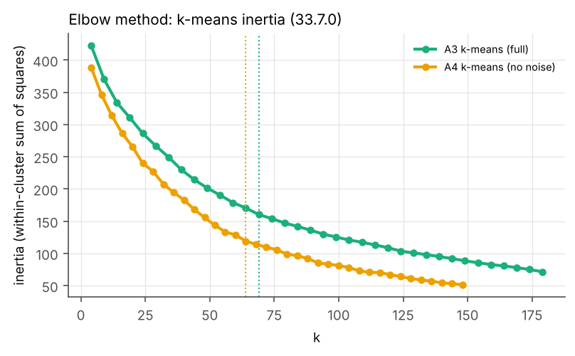

## 2.5 Quality metrics

For a clustering into k clusters, with μᵢ the dependencies inside cluster i
(Nᵢ classes) and εᵢⱼ the dependencies between clusters i and j (directed,
unweighted class graph), we use the definitions of the course (Lecture 6–7,
"Ποια θεωρείται καλή διάτμηση"):

* **Cohesion** (intra-connectivity) Aᵢ = μᵢ / Nᵢ². The lecture allows
  μᵢ/Nᵢ² or μᵢ/(Nᵢ(Nᵢ−1)). We use Nᵢ² because it is defined for one-class
  clusters (packages and ACDC produce some). We report the mean over clusters.
* **Coupling** (inter-connectivity) Eᵢⱼ = εᵢⱼ / (2·Nᵢ·Nⱼ), averaged over all
  cluster pairs.
* **MQ – Modularization Quality** (course definition, Mancoridis et al. 1998):
  MQ = (1/k)·ΣAᵢ − (2/(k(k−1)))·ΣEᵢⱼ, in [−1, 1]. This is the **main quality
  measure** of the assignment. Because Aᵢ divides by Nᵢ², MQ favours many
  small, dense clusters, so it is only comparable between architectures
  with a similar number of clusters.
* Supplementary measures, independent of k: **TurboMQ/k**, the mean cluster
  factor 2μᵢ/(2μᵢ+εᵢ) of the later Bunch MQ (Mitchell & Mancoridis 2006), where
  εᵢ counts all dependencies crossing the border of cluster i; and **intra
  deps**, the share of all dependencies that stay inside a cluster.
  TurboMQ (the sum, which grows with k) is given in the appendix.

## 2.6 Additional analyses from the lectures

* **MoJoFM** (Lecture 6–7): MoJoFM(A, R) = (1 − mno(A,R) / max mno(·,R)) · 100 %,
  where mno is the minimum number of *Move* and *Join* operations that turn
  architecture A into reference R (100 % = identical). It is computed with the
  original MoJo 2.0 implementation (`tools/mojo.jar`). The system has no
  expert ("ground-truth") architecture, so we use the developers' **package
  structure** as the reference for every version and, for the latest version,
  also the **AI architecture** of Phase 4. MoJoFM between the architectures
  of consecutive versions measures **architectural stability**; we also report
  the adjusted Rand index (ARI).
* **Omnipresent classes with the Bunch rule** (Lecture 6–7): in-degree
  > 3 × average in-degree. We compare it with JNode (Constantinou et al. 2015),
  and, as in the lecture's comparison of "System", "Noise" and "Bunch", we
  measure how close ACDC gets to the reference architecture without each set.
* **Architectural smells and their evolution** (Lecture 5; Fontana et al.
  2016, Sas et al. 2019), each normalised by the number of classes or packages:
  *cyclic dependency* (packages/classes in a dependency cycle, i.e. a
  strongly connected component of size > 1, found by depth-first search);
  *hub-like dependency* (classes with fan-in and fan-out above the system
  medians and |fan-in − fan-out| < 0.25·(fan-in + fan-out)); *unstable
  dependency* (packages, instability I = Ce/(Ca+Ce), of which more than 30 %
  of the package dependencies point to less stable packages – the Arcan
  threshold); *god component* (packages with more classes than mean + 2σ of
  the package sizes, since the lecture leaves the threshold open).
* **Lehman's laws** (Lecture 1–2): besides size and dependency growth, we count
  the **dependencies added and removed** per version (as in the lecture's
  Eclipse example for law II) and the **commits per month** between the
  analysed releases (law IV, conservation of organisational stability).

# 3. Results and discussion

## 3.1 Size

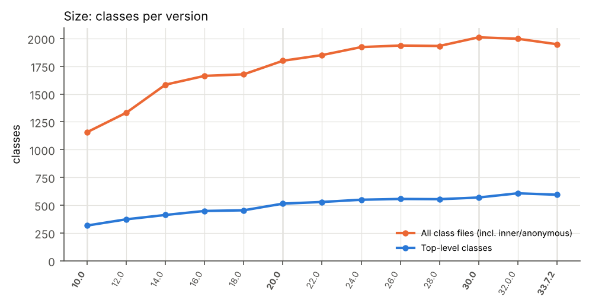

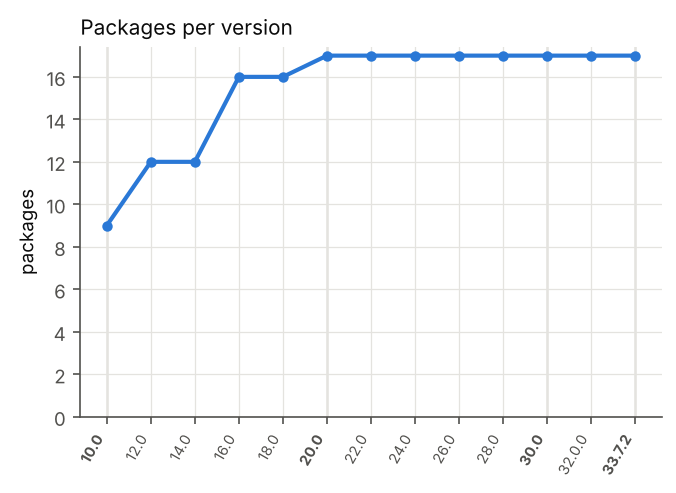

Guava grew from **317 to 594 top-level classes (+87 %)** and from 1,157 to
1,948 class files over 15 years. Growth is concentrated in the first five
years:

* **10.0 → 20.0 (2011–2016): +62 %.** New packages were added: `hash`, `math`
  and `reflect` in 12.0; `escape`, `html`, `xml` and the public-suffix list in
  16.0; and the `graph` library in 20.0 (+76 classes). The number of
  packages grew from 10 to 18.
* **20.0 → 32.0 (2016–2023): +18 %**, without new packages. The changes are
  additions to existing packages, mainly Java 8 support between 20.0 and 24.0
  (`Streams`, `MoreCollectors`, `CollectSpliterators`, `FluentFuture`,
  `MoreFiles`, `ImmutableIntArray`) and graph traversal (`Traverser`).
* **32.0 → 33.7 (2023–2026): −2 %.** 14 classes were added and 18 removed
  (Table 9). The library is now in maintenance mode.

**Lehman's laws.** *Continuing change (I)* holds: every sampled release
changes classes (Table 9). *Continuing growth (VI)* holds, but with a
strongly decreasing rate. This is the inverse-square growth that Turski's
model associates with the growing effort of changing a large system, and it
is reinforced here by Guava's compatibility policy: public API can only be
removed after deprecation, and new API must fit an existing package. Since
20.0 no sampled release added more than 5 % new classes, which is
consistent with *conservation of familiarity (V)*.

## 3.2 Class dependencies

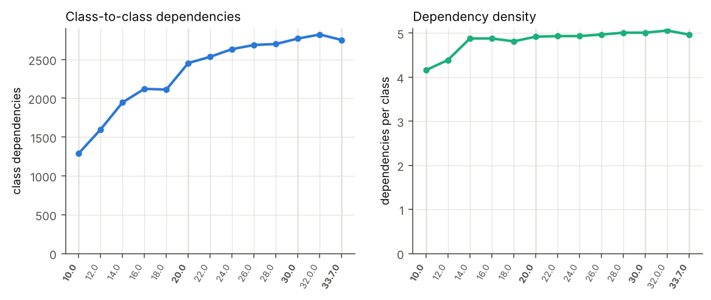

Dependencies grew from **1,289 to 2,750 (×2.1)**, faster than the classes
(×1.8). The density rose from **4.2 to 5.1 dependencies per class** (peak
in 32.0.0) and, unlike in a system that is actively restructured, it
**never decreases**. This is a clear case of *increasing complexity (II)*.
New features are built on top of the existing collection and base APIs, so
each new class adds dependencies to a dense core. Guava is also denser than
an application framework: our first system (Spring AI) had 2.9–4.1
dependencies per class.

## 3.3 Widely-used (noise) classes

Table 3 – Noise classes (JNode) per version; *Top-30 fan-in flagged* = how
many of the 30 most-used classes JNode flags.

{{TABLE_NOISE}}

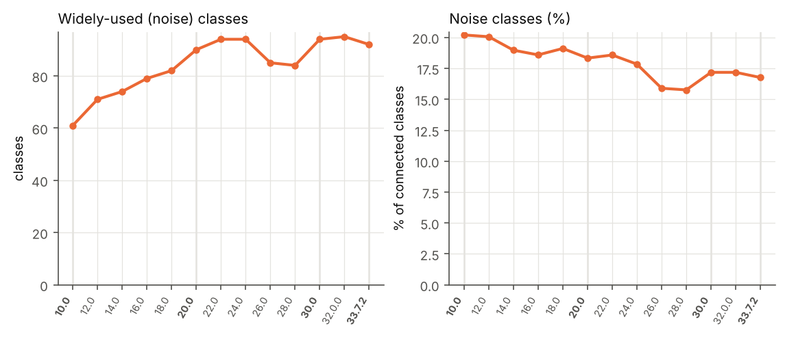

JNode flags **15–82 top-level classes (4–15 %)**. They have a fan-in about 4
times higher than the other classes (12–20 vs 3–4). But **what** JNode flags
is only partly what one would call "omnipresent":

* In 33.7.0, **43 of the 48 classes of `common.base`** are noise, which is
  plausible (`Preconditions`, `Function`, `Predicate`, `Optional`,
  `CharMatcher`, ...).
* **18 of the 19 classes of `common.cache` are also flagged**, although the
  cache is used by only one other package (`eventbus`, 3 dependencies). The
  cache depends on base, collect and concurrency, so it lies on many shortest
  paths inside its reachable subgraph and gets a high SIG. That makes it
  "significant", not "widely used".
* Many genuine hubs are **not** flagged: only 5–16 of the 30 classes with the
  highest fan-in are noise. Missed are `Iterators`, `Ordering`, `Multiset`,
  `ImmutableCollection`, `Iterables`, `Lists`, `Sets`, `Multimap` and
  `HashCode`, which are core collection types used throughout the library.

As in our first analysis, JNode's SIG is a reachability measure, and its
noise set must be sanity-checked against fan-in. For Guava, removing the noise
mostly removes `common.base` and `common.cache` from the graph.

## 3.4 Recovered architectures (A1–A4)

Table 4 – Mean over the 13 versions.

{{TABLE_MEANS}}

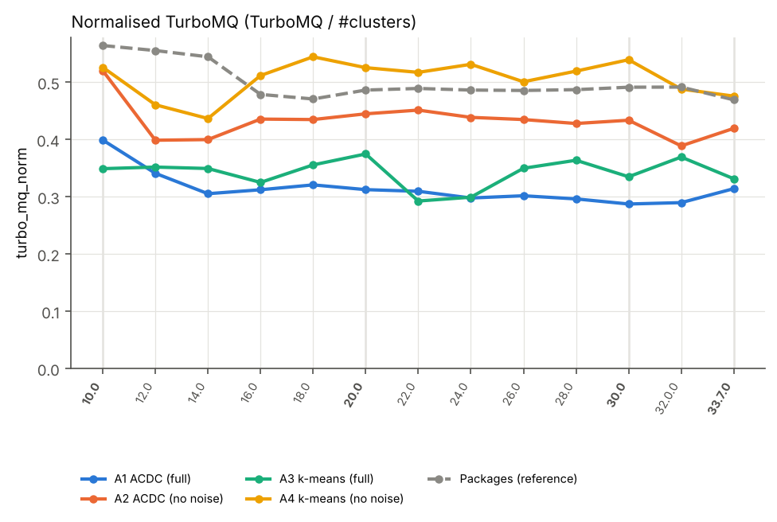

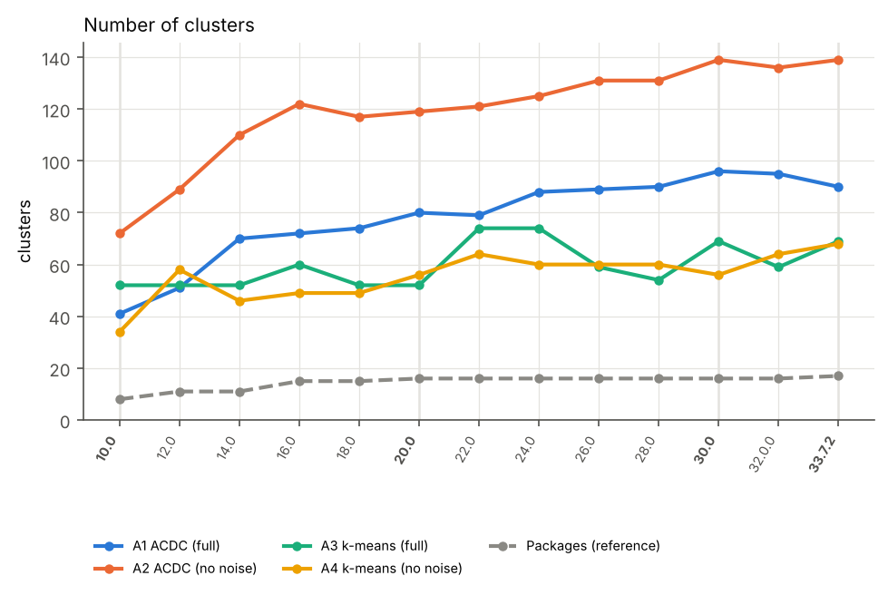

**Size.** ACDC produces 41 (10.0) to 90–96 clusters (30.0–33.7.0), with a
largest cluster of 27–52 classes. k-means produces 40–74 clusters of at
most 43 classes. The packages are very coarse: 8–17 groups, the largest
being `common.collect` with 179–217 classes.

**Quality by the course MQ – ACDC wins, the packages are last.** ACDC has
the highest MQ in every version (0.24–0.26; mean 0.251 for A1, 0.246 for A2),
k-means follows (0.169 / 0.182), and the package structure is clearly last
(0.100 on average, between 0.084 and 0.121, lowest in 33.7.0). MQ is dominated by its
cohesion term: ACDC's clusters of 5–7 classes are dense, while
`common.collect` with ~200 classes can never be (μᵢ/Nᵢ²).

**Quality by the k-independent measures – the packages win.** Guava is the
opposite of an application framework. Its **package decomposition is by far
the most modular on the dependency share: 71 % of all dependencies stay inside
a package**, against 37 % (A1) and 30 % (A3). On TurboMQ/k the packages (0.50)
are better than A1/A2/A3 and equal to A4. Guava's packages are cohesive
feature libraries (`graph`, `hash`, `io`, `util.concurrent`) built around
a dense core. The algorithms have no notion of "feature". They see one
densely connected graph, and to reach clusters of 5–10 classes they must cut
through the dense core (`collect`, `base`), which costs many dependencies.
Their much higher **cohesion** (0.25 for ACDC vs 0.11 for packages) only
reflects their small cluster size (μᵢ/Nᵢ²), not a better modularisation.

* **ACDC vs k-means.** ACDC has the higher cohesion and MQ and keeps more
  dependencies inside clusters (37 % vs 30 % on the full graph). k-means has
  the higher TurboMQ/k (0.34 vs 0.31 on the full graph, 0.51 vs 0.43 without
  noise).
* **Noise removal** (A1→A2, A3→A4) raises TurboMQ/k by **+0.12 (ACDC) and
  +0.16 (k-means)** and the intra share by 10–15 percentage points. It also
  raises the packages' TurboMQ/k from 0.50 to 0.65. Removing `base` cuts
  most edges that cross package borders. The course MQ hardly changes (ACDC
  0.251 → 0.246, k-means 0.169 → 0.182).

**ACDC parameters.** On 33.7.0 (Table 6, Figure 9): BodyHeader has no effect
(`bso` = `so`). Without OrphanAdoption, ClusterLast puts the orphans into one
cluster of 276 classes, and TurboMQ/k falls from 0.31 to 0.25. The maximum
cluster size of SubGraph has practically **no influence** (5 → 91 clusters,
≥ 10 → 90): Guava's dominator subgraphs are naturally small.


Table 6 – ACDC parameter experiment (33.7.0).

{{TABLE_ACDC}}

## 3.5 Quality of the architecture over time

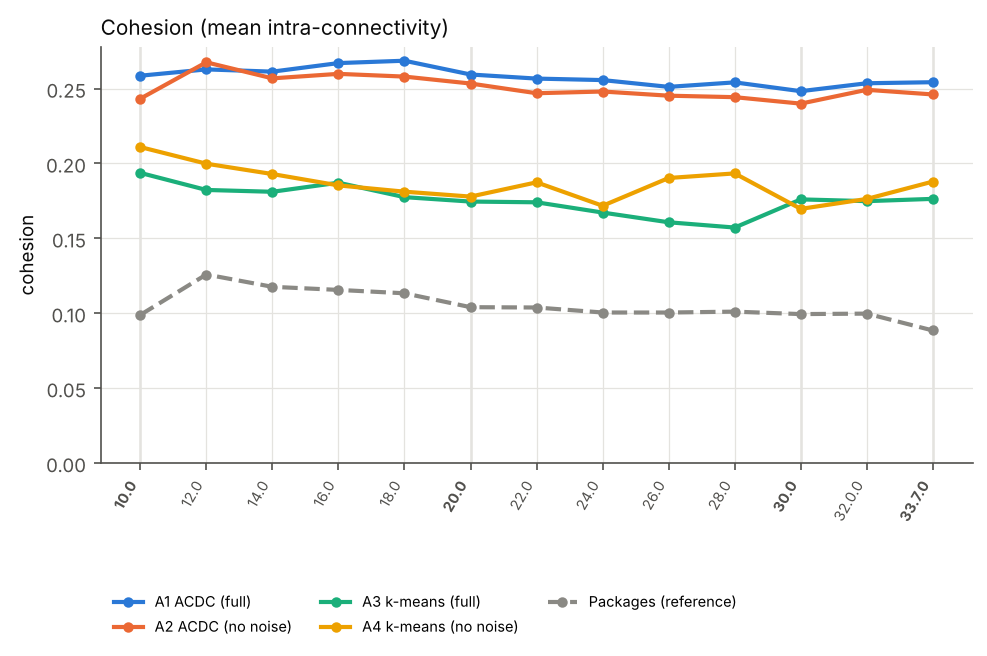

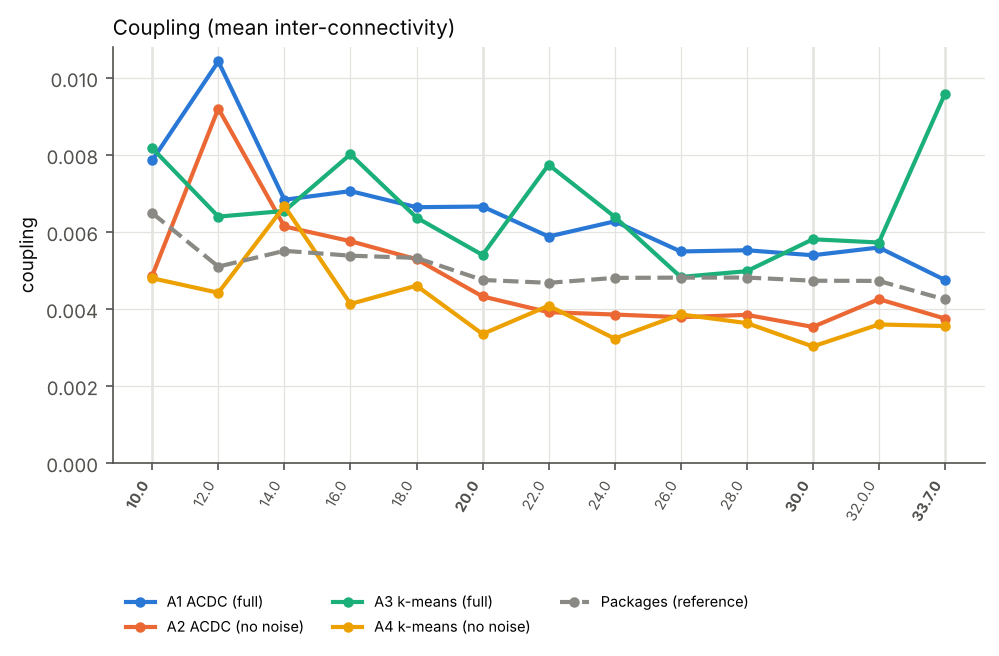

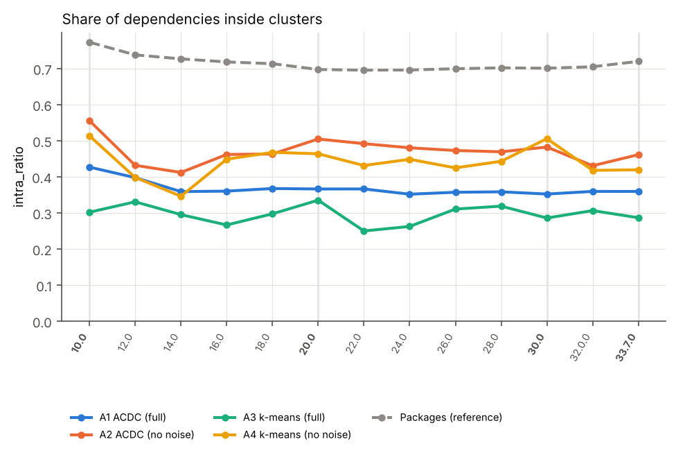

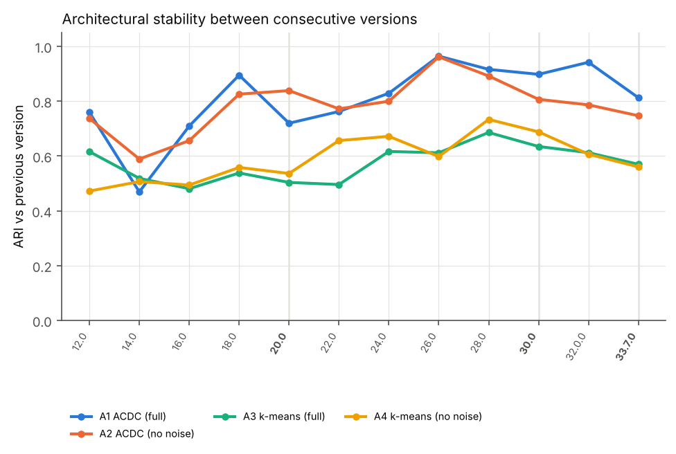

1. **10.0 → 16.0 – modularity declines while the library expands.** ACDC
   TurboMQ/k falls from 0.40 to 0.31, its intra share from 0.43 to 0.36, and
   the package decomposition from 0.56 to 0.48. New packages (`hash`, `math`,
   `reflect`, `escape`, ...) are not independent: they depend on base,
   collect and primitives. Each one adds cross-package edges.
2. **16.0 → 33.7.0 – stable at a lower level.** All full-graph measures stay
   flat: A1 TurboMQ/k 0.29–0.32, packages 0.47–0.49 with an intra share of
   0.70–0.72. The `graph` library (20.0), the biggest addition of this period,
   is a well-separated package and does not reduce modularity.
3. **Coupling** (mean inter-connectivity) falls for ACDC (0.0079 → 0.0048)
   and the packages (0.0065 → 0.0042), but this mostly reflects the growing
   cluster count and size (εᵢⱼ is divided by NᵢNⱼ), not a real decoupling. The dependency density rises at the same time
   (3.2).

So Guava shows *declining quality (VII)* in its expansion phase and then
stabilises. Unlike our first system, there is no restructuring phase that
improves the measures again: the compatibility policy makes a re-modularisation
of a public library practically impossible. Packages and public classes are
API, and moving them would break users.

**Stability.** Between the sampled versions ACDC is more stable (mean ARI
0.81 for A1, 0.78 for A2) than k-means (0.57 / 0.59). Values are lower than
for consecutive releases, because each step spans two majors (and up to 3
years). The least stable step is 12.0 → 14.0 (A1 ARI 0.47), where 58
classes were added and 23 removed.

## 3.6 Distance to the reference architecture (MoJoFM)

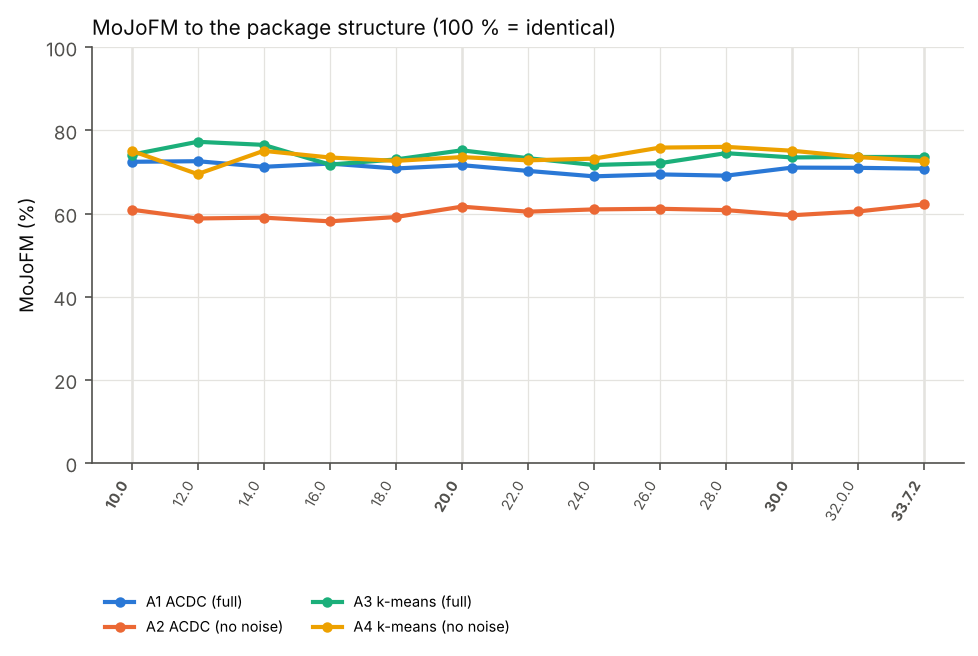

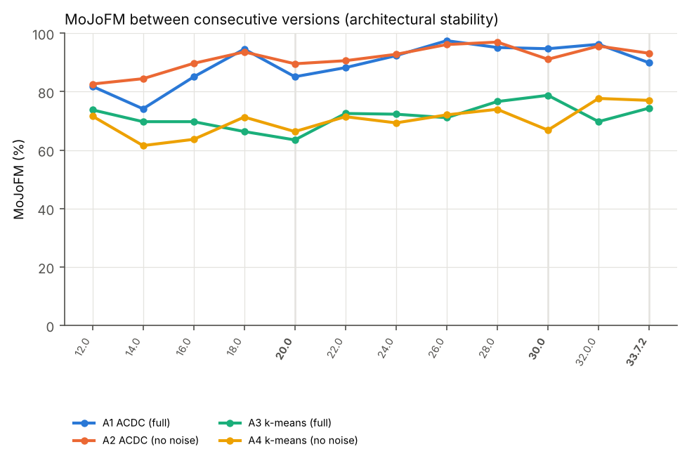

Guava has no expert-validated architecture, so we use the package structure
(all versions) and the AI architecture (33.7.0) as reference architectures for
the lecture's MoJoFM.

* **To the packages** (Table 13): all recovered architectures are 69–83 %
  similar to the packages. Values are high because the packages are coarse:
  merging small clusters into them needs few Move/Join operations. Unlike in
  Spring AI, **k-means is closer than ACDC** (A3 73.9 % vs A1 70.9 %), and
  **removing the noise classes brings both closer** (A2 74.5 %, A4 80.2 %), as in
  the lecture's experiment.
* **To the AI architecture** (Table 14): the packages are closest (75.7 %),
  then k-means (69.0 %, 74.6 % without noise), then ACDC (66.0 %, 68.7 %).
  Conversely, the AI architecture is 94.4 % similar to the packages. It
  differs mainly by splitting `collect` and by grouping small packages
  (escape/html/xml/net, primitives/math).
* **Stability** (Table 15): ACDC is much more stable than k-means (mean MoJoFM
  89.5 % / 88.1 % vs 71.5 % / 72.9 %). ACDC's stability grows as the library
  matures: 74–85 % in the expansion steps (12.0–16.0 and 20.0), 92–97 %
  between 24.0 and 32.0.

Table 13 – MoJoFM (%) of the recovered architectures to the package structure.

{{TABLE_MOJO}}

Table 14 – MoJoFM (%) to the AI architecture (33.7.0).

{{TABLE_MOJO_AI}}

Table 15 – MoJoFM (%) between consecutive sampled versions.

{{TABLE_MOJO_STAB}}

## 3.7 Omnipresent classes: JNode vs Bunch

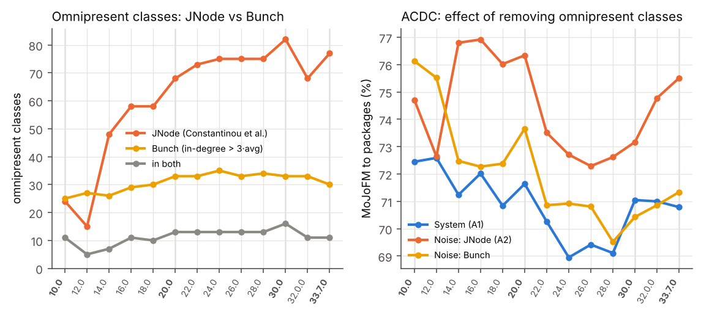

The Bunch rule (in-degree > 3 × average) flags **25–35 classes**, exactly the
hubs that JNode misses (3.3). In 33.7.0 these are `Preconditions`,
`Function`, `Predicate`, `Supplier`, `MoreObjects`, `ImmutableList/Set/Map`,
`Iterators`, `Iterables`, `Lists`, `Maps`, `Sets`, `Ordering`, `Multimap`,
`Multiset`, `HashCode`, `Ints`, `ListenableFuture`, `EndpointPair`, and others.
The two sets hardly overlap (**Jaccard 0.10–0.29**): JNode flags most of
`base` and `cache`, Bunch the most-used classes of `collect` and `base`.

For the effect on ACDC (Table 16), **JNode's noise removal brings ACDC closer
to the packages from 14.0 on** (72–77 % vs 69–74 % for Bunch). Bunch is better
only in 10.0 and 12.0, where JNode needed the threshold fallback. Removing
the Bunch hubs cuts through `collect` and scatters its classes, while
removing `cache` (JNode) removes a separate package that does not affect the
other clusters. The course MQ stays at 0.23–0.26 for all variants.

Table 16 – JNode vs Bunch omnipresent classes and their effect on ACDC.

{{TABLE_BUNCH}}

## 3.8 Architectural smells and their evolution

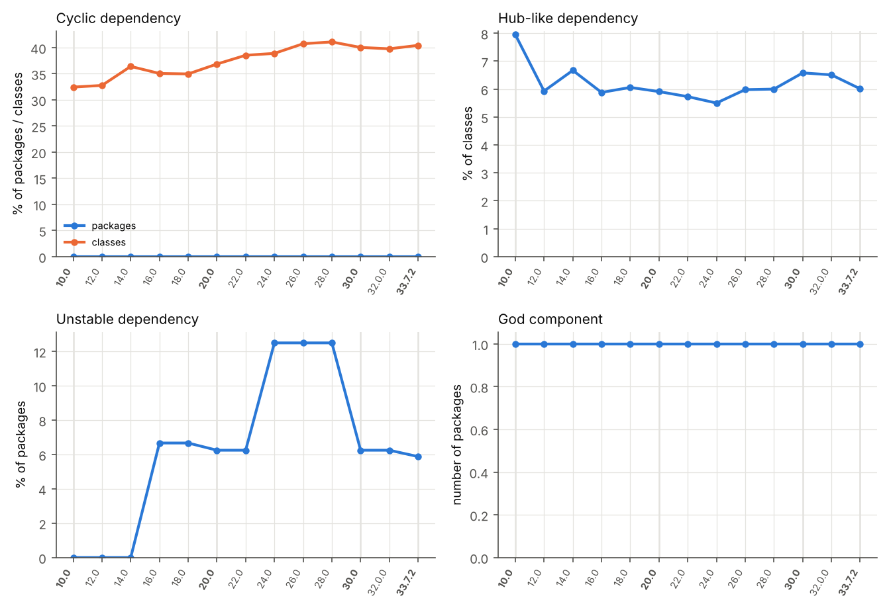

* **Cyclic dependency – none between packages, many inside them.** Guava's
  package dependency graph is **acyclic in all 13 versions**. This is a
  deliberate layering (base → primitives → collect → concurrency → features)
  that the maintainers have kept for 15 years. Inside the packages,
  however, the share of classes in a class-level cycle rises steadily from
  **32 % to 41 %**, almost all of them in `collect`, where interfaces,
  implementations and utilities reference each other (`ImmutableList` ⇄
  `ImmutableCollection` ⇄ `Iterators`, ...). The package boundaries are kept
  clean, and the entanglement grows inside them.
* **Hub-like dependency** affects 5.5–8 % of the classes, highest in 10.0 and
  then stable at ≈ 6 %.
* **Unstable dependency**: only one package, `collect`, between 16.0 and
  28.0. One of its three package dependencies, `math`, was less stable than
  `collect` itself (instability 0.29–0.33 vs 0.27–0.30). In 30.0 `math` became
  more stable than `collect`, and the smell disappears.
* **God component**: `common.collect` in **every** version (threshold
  130–146 classes; `collect` has 179–217). It is the main architectural smell
  of Guava, and it is permanent because its classes are public API.

Table 17 – Architectural smells per version.

{{TABLE_SMELLS}}

## 3.9 Lehman's laws: dependency changes and work rate

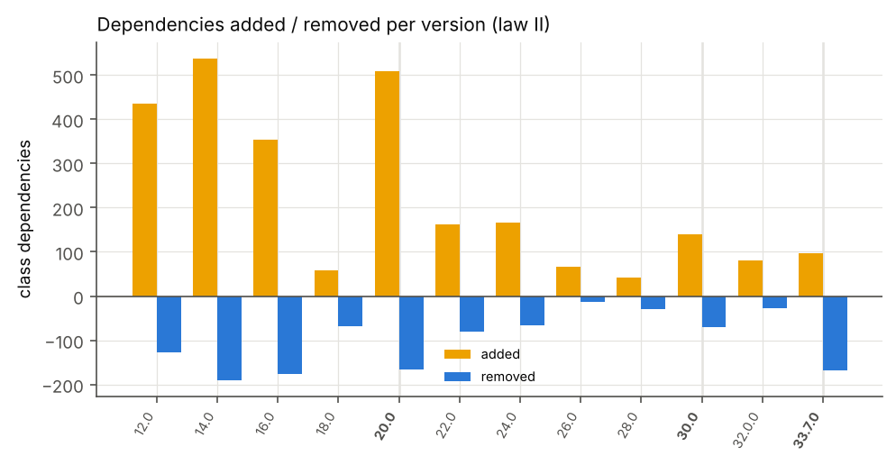

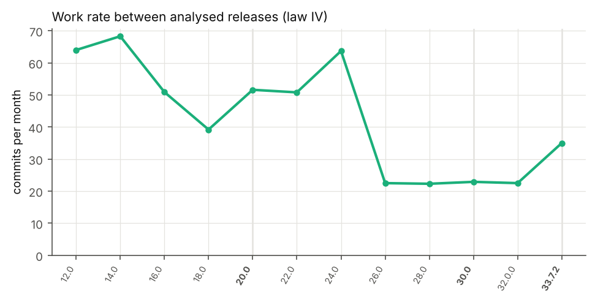

* **Law II – increasing complexity.** In 10 of the 12 intervals Guava **adds
  more dependencies than it removes** (e.g. +538/−190 in 14.0, +508/−167 in
  20.0). Only 18.0 (+59/−68) and 33.7.0 (+97/−168) are small net reductions.
  Unlike
  Spring AI there are no big restructuring releases, so complexity grows
  almost unchecked, matching the rising dependency density (3.2).
* **Law IV – conservation of organisational stability does not hold over 15
  years.** The work rate falls from 64–68 commits/month (2011–2013) to 39–64
  (2013–2018) and ≈ 22 (2018–2023), then rises again to 36 (2023–2026).
  This fits a maturing library whose work shifts to maintenance. (Caveat:
  until 18.0 Guava was mirrored from Google's internal repository, so only
  4–7 author identities appear in that period.)
* **Law VIII – feedback system.** Feedback reaches Guava through issues,
  `@Beta` APIs that may change after user feedback, deprecation cycles before
  removal, and the parallel JRE/Android flavours.
* Guava is an **E-type** system: it has to follow the Java platform (Java 8
  support between 20.0 and 24.0, JDK changes), so the laws apply. Its strong
  compatibility promise is the reason laws II and VII show up so clearly:
  public structure cannot be refactored away.

Table 18 – Dependencies added and removed between sampled versions.

{{TABLE_DEPCHANGES}}

# 4. Architecture recovery with AI (latest version only: 33.7.0)

**Tool and protocol.** **Claude (Anthropic)** through Claude Code, with four
prompts of increasing context (`guava/ai/prompts.md`, inputs in
`guava/ai/inputs/`, verbatim responses in `guava/ai/responses/`).

| Prompt | Information given |
|---|---|
| P1 | Name, version and URL only |
| P2 | README of 33.7.0 + the 17 packages with class counts and sample class names |
| P3 | P2 + the complete list of 554 classes per package + the package dependency graph (50 weighted edges from DependencyExtractor). Because `common.collect` holds 38 % of the classes, the AI had to map **every class** (not only every package) to exactly one component, as ordered regex rules in JSON |
| P4 | Follow-up with the metrics of the P3 architecture vs ACDC, k-means and packages |

Limitation: the same assistant also built the analysis pipeline and had seen
the data, so P1 is not a fully "cold" answer. Repeating the prompts with
another tool (e.g. ChatGPT) would give an independent comparison.

**What the AI produced.**

* **P1 (no context):** a correct package-level layered view (base →
  primitives/math → collect → concurrency → feature libraries) with the
  right patterns (builders, immutable objects, forwarding decorators,
  template methods). Unlike for Spring AI, it contained **no outdated or
  invented parts**: Guava is old, stable and very well known, so the
  model's general knowledge matches the current code. It was uncertain only
  about removed legacy APIs, correctly.
* **P2 (README + packages):** 9 components in 4 layers, and the main smell:
  `common.collect` as a "god package" (209 of 554 classes) whose encapsulation
  relies on package-private visibility.
* **P3 (all classes + dependency graph):** 14 components. `collect` is split
  into *immutable collections*, *multi-collections*, *ranges* and
  *collection utilities*, with a measured component dependency table. It
  showed that **all dependency cycles are inside the collections subsystem**
  and that the rest is a clean layering. It also named the hub classes
  (`Preconditions`, `ImmutableList`, `Maps`, `Iterators`, ...).
* **P4 (metrics feedback):** explained why the split of `collect` lowers the
  share of internal dependencies below the packages, and proposed a
  hierarchical view. Merging the four collection components back into one
  gives 11 components with TurboMQ/k 0.624 and 72.5 % internal dependencies,
  better than the packages on both measures.

Table 10 – Components of the AI architecture (P3).

{{TABLE_AI_COMP}}

Table 11 – AI (P3) architecture vs the other architectures of 33.7.0.

{{TABLE_AI}}

Table 12 – Agreement (ARI) of the AI architecture with the other architectures.

{{TABLE_AI_ARI}}

# 5. Reflection

## 5.1 Comparing the architectures of the latest version

* **Granularity.** AI: 14 components; packages: 17; k-means: 64–69; ACDC:
  84–90. The AI and the packages are at the level of a component diagram.
  The algorithmic architectures are fine-grained "class neighbourhoods".
* **Quality – the verdict depends on the measure.** By the **course MQ**,
  ACDC is best (0.249), then k-means (0.167/0.184), and the coarse
  decompositions are last: AI 0.090 and packages 0.084, because MQ's
  cohesion divides by Nᵢ². On the k-independent measures the AI
  architecture has the **best TurboMQ/k of all (0.574; 0.686 without noise)**, ahead of the packages (0.469), k-means (0.33/0.48)
  and ACDC (0.31/0.42). On the share of internal dependencies the packages
  are best (72 %), then the AI (56 %), then ACDC (36 %) and k-means (29 %).
  The AI pays for splitting `collect` into four parts. Merged, it beats the
  packages on both measures (P4).
* **Agreement.** The AI architecture agrees **moderately with the packages
  (ARI 0.58)** and weakly with ACDC (0.20) and k-means (0.17). ACDC and
  k-means agree with each other at ARI 0.26 (full) / 0.31 (no noise), and with
  the packages at only ≈ 0.1. For a library organised by feature, the
  developers' packages and an architect's view largely coincide, while
  connectivity-based clustering finds a different, cross-cutting structure.
  With the lecture's MoJoFM and the AI architecture as reference, the packages
  are closest (76 %), then k-means (69–75 %) and ACDC (66–69 %). In the other
  direction the AI architecture is 94 % similar to the packages (3.6).
* **Different principles.** The algorithms group classes that *use the same
  things*. For example, ACDC's `Multimaps.ss` cluster gathers the multimap
  implementations and their utilities, and `Hashing.ss` the hash functions.
  These are sensible "class families", but they ignore the feature boundaries
  that Guava's users and maintainers work with.

**Our assessment.** For Guava the **AI architecture (P3, possibly with the
collections merged as in P4) is the most useful and the best by the
k-independent metrics**. The package structure is a very good second
choice. Unlike in an application framework, a library's packages are
designed as the architecture. ACDC and k-means are useful to look *inside*
the large packages (e.g. families in `collect`, `util.concurrent`), but not
as the top-level architecture. For *evolution* studies ACDC remains the best
automatic method: it has the highest course MQ and is the most stable
between versions (MoJoFM ≈ 89 % vs ≈ 72 % for k-means).

## 5.2 Does the AI tool help? How do information and prompts influence the result?

* **For a well-known, stable system the AI is already good without context**
  (P1). This is the opposite of what we saw for a young, fast-changing
  framework (Spring AI), where P1 contained removed modules. The value of extra
  information is in **precision**, not correctness. With the class list and
  the dependency graph (P3) the answer becomes a complete, checkable mapping
  with measured dependencies and cycles.
* **The granularity of the input determines the granularity of the
  output.** With packages only (P2) the AI cannot see inside `collect`. Only
  when we gave it the class names and asked for a class-level mapping did it
  split the god package, using naming conventions (`Immutable*`, `Regular*`,
  `*Multimap`).
* **Feeding back metrics (P4) works well.** The AI correctly explained the
  effect of granularity and proposed a hierarchical view instead of
  optimising the metric blindly.
* **Risks.** The AI does not measure; every claim (e.g. "only eventbus uses
  the cache", "cycles only inside collect") had to be checked against the
  extracted data. In its first draft of P4 one estimate (the number of
  dependencies cut by splitting `collect`) and one statement about the cache
  had to be corrected.

## 5.3 Which method for other systems?

1. **Start from the packages and the AI**, given the extracted facts (class
   list + dependency graph), for the top-level component view. This is
   especially effective for libraries and well-known systems.
2. **Use ACDC with noise removal** for *evolution*: it is deterministic and
   the most stable across versions, and its clusters show the internal
   families of large packages.
3. **Check the noise set** against fan-in before trusting A2/A4. JNode
   flagged an entire leaf package (`cache`) and missed most collection
   hubs.
4. k-means needs an extra decision (features, k) and is the least stable. It
   is useful as a second opinion, not as the primary method.

# 6. Threats to validity

* **Sparse sampling.** Every second major release (gaps of 6 months to 3
  years) hides short-term changes and lowers the stability values.
* **Binary analysis** of the `-jre` jar: reflection and the Android flavour
  are not covered.
* **Tools.** JNode was patched (performance and precision, identical where the
  original works) and needed a threshold fallback for 10.0 and 12.0. ACDC is
  the ARCADE port and needed file-style names (2.3).
* **k-means** depends on the feature representation and on the elbow choice
  of k. **Cohesion, the course MQ and TurboMQ** depend strongly on k, so TurboMQ/k and the
  intra share complement the course MQ when k differs strongly.

# References

* Mancoridis S. et al. (1998). *Using Automatic Clustering to Produce High-Level System Organizations of Source Code.* IWPC.
* Mitchell B. S., Mancoridis S. (2006). *On the automatic modularization of software systems using the Bunch tool.* IEEE TSE 32(3).
* Tzerpos V., Holt R. C. (2000). *ACDC: An Algorithm for Comprehension-Driven Clustering.* WCRE.
* Lehman M. M. (1996). *Laws of Software Evolution Revisited.* EWSPT.
* Turski W. M. (1996). *Reference model for smooth growth of software systems.* IEEE TSE 22(8).
* Satopää V. et al. (2011). *Finding a "Kneedle" in a Haystack.* ICDCSW.
* Guava README, user guide (wiki) and Javadoc, v33.7.0.

# Appendix A – Full metric tables

Table 5 – Number of clusters (k).

{{TABLE_K}}

Table 7 – TurboMQ/k.

{{TABLE_TMQN}}

Table 7b – TurboMQ.

{{TABLE_TMQ}}

Table 7c – MQ (course definition).

{{TABLE_BASICMQ}}

Table 8a – Cohesion.

{{TABLE_COH}}

Table 8b – Coupling.

{{TABLE_COUP}}

Table 8c – Share of dependencies inside clusters.

{{TABLE_INTRA}}

Table 8d – Stability (ARI with the previous sampled version).

{{TABLE_STAB}}

Table 9 – Package and class changes between sampled versions.

{{TABLE_PKGCHANGES}}

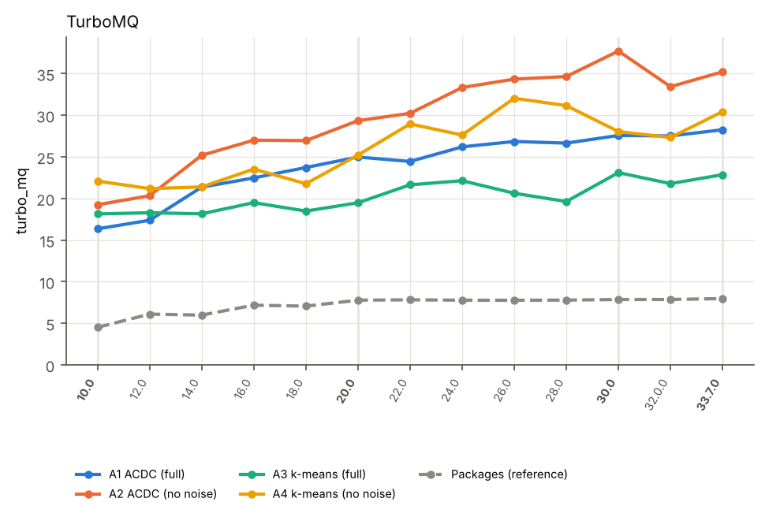

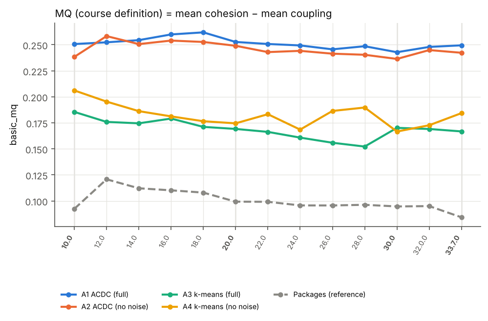
