> Code and data: GitHub repository `epl484.fall26.project1.teamX`
> (pipeline in `scripts/`, data in `data/`, all computed results in `results/`).
> Every number in the tables of this report is generated from the result
> files by `scripts/report_tables.py`.

# 1. Project choice and characteristics

## 1.1 What is Spring AI?

[Spring AI](https://github.com/spring-projects/spring-ai) is the Spring
ecosystem's application framework for AI engineering. Its goal is to bring
Spring's principles (portability, modularity, POJOs, dependency injection)
to applications that use generative AI models. It offers:

* **Portable model APIs** for chat, embedding, image generation, audio
  (transcription, text-to-speech) and moderation (`ChatModel`,
  `EmbeddingModel`, `ImageModel`, ...), with synchronous and streaming calls;
* **adapters to ~12 AI providers** (OpenAI, Anthropic, Amazon Bedrock,
  Google GenAI/Vertex AI, Ollama, Mistral AI, DeepSeek, ElevenLabs, Stability AI, ...);
* the fluent **`ChatClient`** API with an **advisor** (interceptor) chain for
  chat memory, RAG, logging and guard-rails;
* **structured output** (LLM text → POJOs), **tool/function calling** and
  **MCP** (Model Context Protocol) client/server support;
* **Retrieval-Augmented Generation**: an ETL pipeline (document readers,
  splitters), a portable **`VectorStore`** API with a SQL-like metadata filter
  language and ~20 vector-database adapters;
* **observability** (Micrometer) and **Spring Boot auto-configuration/starters**
  for everything above.

The project lives in the `spring-projects` GitHub organisation (Apache 2.0).
Its first commit was made on 2023-07-24. It has 4,249 commits, 4,007 of them
after 1/1/2024, and it is very actively developed.

## 1.2 Eligibility (Phase 1)

| Criterion | Spring AI |
|---|---|
| ≥ 10 major/minor versions | 48 tags: 4 GA (0.8.0, 1.0.0, 1.1.0, 2.0.0), 21 feature milestones, 4 RCs, 19 patches. Strictly 5 major.minor lines (0.8, 1.0, 1.1, 2.0, 2.1); **25 feature releases** if milestones are counted (see note) |
| Repository on GitHub | `spring-projects/spring-ai` |
| Latest version ≥ 10K LOC | 2.1.0-M1: 1,341 production `.java` files, **95,546 non-comment, non-blank LOC** |
| Not archived / not a fork | ✔ / ✔ (original repository) |
| ≥ 50 commits since 1/1/2024 | **4,007** |
| Created before 2024 | 2023-07-24 |

*Note on versions.* Spring projects deliver all features of a line through
public **milestones** (M1…M8), followed by a release candidate and a GA. For
example, the 1.0 line grew from 489 to 828 classes during its eight
milestones. We therefore treat milestones as feature releases (agreed with
the instructor in the approval e-mail ‹to be confirmed›).

## 1.3 Number and size of versions

We analyse the **continuous sequence of all 25 feature releases** from 0.8.0
(Feb 2024) to 2.1.0-M1 (Sep 2026), i.e. every milestone and GA with no gaps.
Table 1 gives the size of each version. *Modules* are the Maven modules
that contain code. *Class files* include inner and anonymous classes.
*Top-level classes* are compilation units. *Dependencies* are distinct
class-to-class dependencies between top-level classes.

Table 1 – Size of the analysed versions.

| Version | Date | Modules | Packages | Class files | Top-level classes | Δ classes | Dependencies | Deps/class |
|---|---|---|---|---|---|---|---|---|
| 0.8.0 | 2024-02-26 | 21 | 84 | 543 | 290 | – | 827 | 2.89 |
| 1.0.0-M1 | 2024-05-28 | 35 | 143 | 957 | 489 | +68.6% | 1593 | 3.30 |
| 1.0.0-M2 | 2024-08-23 | 42 | 186 | 1371 | 667 | +36.4% | 2329 | 3.54 |
| 1.0.0-M3 | 2024-10-20 | 45 | 200 | 1438 | 707 | +6.0% | 2680 | 3.83 |
| 1.0.0-M4 | 2024-11-20 | 47 | 210 | 1496 | 739 | +4.5% | 2895 | 3.95 |
| 1.0.0-M5 | 2024-12-23 | 48 | 229 | 1576 | 760 | +2.8% | 3053 | 4.05 |
| 1.0.0-M6 | 2025-02-14 | 51 | 231 | 1542 | 775 | +2.0% | 3104 | 4.05 |
| 1.0.0-M7 | 2025-04-10 | 104 | 240 | 1619 | 828 | +6.8% | 3241 | 3.98 |
| 1.0.0-M8 | 2025-04-30 | 104 | 239 | 1572 | 812 | -1.9% | 3097 | 3.88 |
| 1.0.0 | 2025-05-19 | 102 | 228 | 1562 | 783 | -3.6% | 2969 | 3.87 |
| 1.1.0-M1 | 2025-09-08 | 110 | 252 | 1717 | 847 | +8.2% | 3194 | 3.86 |
| 1.1.0-M2 | 2025-09-22 | 113 | 265 | 1807 | 895 | +5.7% | 3365 | 3.84 |
| 1.1.0-M3 | 2025-10-03 | 115 | 269 | 1856 | 911 | +1.8% | 3387 | 3.78 |
| 1.1.0-M4 | 2025-11-01 | 116 | 270 | 1903 | 928 | +1.9% | 3472 | 3.80 |
| 1.1.0 | 2025-11-12 | 117 | 270 | 1908 | 929 | +0.1% | 3440 | 3.76 |
| 2.0.0-M1 | 2025-12-11 | 120 | 275 | 1969 | 962 | +3.6% | 3590 | 3.79 |
| 2.0.0-M2 | 2026-01-23 | 130 | 286 | 2025 | 995 | +3.4% | 3746 | 3.82 |
| 2.0.0-M3 | 2026-03-16 | 130 | 307 | 2177 | 1112 | +11.8% | 4181 | 3.81 |
| 2.0.0-M4 | 2026-03-26 | 130 | 307 | 2184 | 1113 | +0.1% | 4181 | 3.80 |
| 2.0.0-M5 | 2026-04-27 | 121 | 282 | 1899 | 1007 | -9.5% | 3583 | 3.60 |
| 2.0.0-M6 | 2026-05-08 | 118 | 279 | 1915 | 997 | -1.0% | 3554 | 3.61 |
| 2.0.0-M7 | 2026-05-22 | 112 | 273 | 1894 | 980 | -1.7% | 3520 | 3.64 |
| 2.0.0-M8 | 2026-05-27 | 112 | 274 | 1902 | 983 | +0.3% | 3538 | 3.64 |
| 2.0.0 | 2026-06-12 | 112 | 278 | 1901 | 988 | +0.5% | 3451 | 3.54 |
| 2.1.0-M1 | 2026-09-24 | 116 | 286 | 2015 | 1039 | +5.2% | 3725 | 3.63 |

## 1.4 Is the architecture documented?

Partly. The [reference documentation](https://docs.spring.io/spring-ai/reference/)
describes the concepts (models, prompts, embeddings, tools, RAG, advisors,
vector stores, MCP) and contains a high-level integration diagram ("connect
your *Data* and *APIs* with the *AI Models*"). The repository has a `design/`
folder with short design records. *Design 02 – Spring Boot Modularity* is
the only document that states an architectural rule: the core must not
depend on Spring Boot, auto-configuration modules depend on the core, and
starters contain no code. The Maven build enforces this rule
(`maven-enforcer-plugin`). There is **no documented component/connector view
and no documented decomposition**. The module structure and the package
naming (`*.autoconfigure`, `vectorstore.<vendor>`, `<provider>.api`) are the
only other architectural evidence.

# 2. Methodology

Figure 1 summarises the pipeline. All steps are scripts in the repository and
can be re-run with the commands in `README.md`.

```
GitHub tags ─► version selection ─► Maven BOM ─► module jars ─► 1 merged jar / version
                                                                  │
                         ┌────────────────────────────────────────┤
                         ▼                                        ▼
            DependencyExtractor.jar                           JNode.jar
            class dependencies (csv)                    noise classes (csv)
                         │                                        │
                         └──────────► top-level class graph ◄─────┘
                                     │                     │
                                full graph           graph without noise
                                │      │               │        │
                             ACDC(A1) k-means(A3)   ACDC(A2) k-means(A4)
                                └──────┴─── metrics ───┴────────┘
                         cohesion · coupling · BasicMQ · TurboMQ · stability
```
*Figure 1 – Analysis pipeline.*

## 2.1 Data collection

1. **Releases.** All 48 tags were listed with `git ls-remote --tags`
   (`data/tags.csv`). Creation dates and the Phase 1 statistics come from a
   blob-less clone (`scripts/project_stats.sh`).
2. **Binaries.** Spring AI is a multi-module Maven project (21 modules in
   0.8.0, 116 in 2.1.0-M1), and its module structure changes often (e.g. the
   1.0.0-M7 split of `spring-ai-core`). To analyse the *whole system*
   consistently, `scripts/collect_versions.py` reads each release's **BOM**
   (`spring-ai-bom`, the official list of the release's artifacts). It
   downloads every listed module jar from Maven Central or, for old
   milestones, from `repo.spring.io/milestone`. It then merges all
   `org/springframework/ai/**.class` files into **one jar per version**
   (`data/workspace/<v>/bin/`). This is the input format of the course tools.

## 2.2 Data cleaning

* **Excluded releases.** 19 *patch* releases (bug fixes on maintenance
  branches, published in parallel with newer lines, e.g. 1.0.9 and 2.0.0 on
  the same day) and 4 *release candidates* (feature-frozen, practically
  identical to the following GA). This left **25 of 48** releases.
* **Excluded artifacts.** *Starters* (no code), `spring-ai-test` (test
  utilities), the BOM and docs. `module-info`/`package-info` classes and
  third-party classes were also dropped. Classes that appear in two modules
  (split packages) were kept once.
* **Inner classes.** DependencyExtractor and JNode work on class files. For
  architecture recovery we fold inner/anonymous classes (`A$B`, `A$1`) into
  their top-level class and drop the resulting self-dependencies. A
  top-level class is noise if any of its class files is flagged by JNode.
* **Isolated classes.** 2–15 classes per version have no dependency to or
  from another Spring AI class. They cannot be clustered from dependencies and
  are left out of A1–A4 (column *Isolated* in Table 3).

## 2.3 Tools and libraries

| Step | Tool / library |
|---|---|
| Class dependencies (3.2) | Course **DependencyExtractor.jar** (bytecode; EXTENDS, IMPLEMENTS, METHOD_CALL, METHOD_PARAMETER, FIELD_REFERENCE, TYPE_USAGE, ...) |
| Noise classes (3.3) | Course **JNode.jar**, with two documented fixes (below) |
| ACDC (A1, A2) | ACDC (Tzerpos & Holt) – Java port from USC **ARCADE** (`tools/acdc/`, BSD licence). The York wiki link was not reachable from our environment |
| Clustering (A3, A4) | **scikit-learn** `KMeans`, `TruncatedSVD`; `kneed` (elbow) |
| Metrics, tables, plots | Python 3.13, numpy, scipy, matplotlib |
| PDF | pandoc + headless Chromium |

**Fixes to JNode.** JNode needed more than 2 hours per 2,000-class version
and broke down on the largest versions. We decompiled it (CFR) and recompiled
three methods; `tools/jnode-patch/` documents the patch:

1. *Performance* – a class-name lookup that scanned the whole class list on
   every step of the subgraph extraction, and a set-membership test written
   as an iteration, were replaced by hash lookups. The output is
   **byte-identical** to the original on 0.8.0, 1.0.0-M1 and 1.0.0-M2. The
   run time dropped from ~9 min to ~1.3 min for 1.0.0-M1.
2. *Precision* – JNode's CR model rounds weights to 3 decimals and initialises
   every weight to `round(1/n, 3)`. For **n > 2,000 class files** this rounds
   to **0**. The shortest-path weights then become 0, `1/0 = ∞`, every SIG is
   normalised to 0, and no noise is found. This happened for exactly the four
   versions with more than 2,000 class files (2.0.0-M2/M3/M4, 2.1.0-M1).
   We re-ran all versions with 4-decimal rounding. On the 20 versions where
   the original worked, the noise sets agree with Jaccard 0.88–1.00 (Table 3).
3. *Threshold fallback* (in our scripts, not in JNode) – JNode flags a class
   if its normalised SIG ≥ mean + 1σ. For 0.8.0 this limit (1.004) is above
   the maximum (1.0), so nothing is flagged. Only for that case we clamp the
   limit to the maximum SIG, i.e. the classes with the highest SIG are noise.

**Changes to ACDC.** (a) Optional parameters `maxClusterSize` (default 20)
and pattern set (`b` BodyHeader, `s` SubGraph, `o` OrphanAdoption), so that
we can run the experiment suggested in the tutorial. (b) A hash map for node
lookup when reading the RSF file (same output, linear instead of quadratic
time). Input: `data/rsf/<v>_full.rsf` / `_nonoise.rsf` with one
`depends A B` line per distinct dependency.

## 2.4 Implementation steps

1. `collect_versions.py` → merged jars, `data/versions.csv`, `data/modules/`.
2. `run_tools.sh` / `run_jnode_pool.sh` → `data/dependencies/<v>.csv`,
   `data/noise/<v>.csv`.
3. `recover.py`, for each version: build the top-level class graph; write the
   two RSF files; **A1/A2** ACDC on the full graph and on the graph without
   noise classes (noise nodes and all their edges removed); **A3/A4** k-means
   on the same two graphs; **PKG** – the developers' Java package
   decomposition as a reference; evaluate all of them with `metrics.py`.
4. `acdc_params.py` (ACDC experiment), `ai_inputs.py` / `ai_eval.py` (Phase 4),
   `noise_fanin.py`, `compare_noise.py`, `module_changes.py`, `plots.py`,
   `report_tables.py` + `build_report.sh` (this report).

**Feature vectors for k-means.** k-means needs points in a vector space, so
each class is represented by its *dependency profile*: its row of the
symmetric adjacency matrix *A + Aᵀ + I* (the classes it uses, the classes
that use it, and itself). Rows are L2-normalised and reduced to 64
dimensions with truncated SVD (LSA). On the normalised vectors, Euclidean
k-means approximates clustering by cosine similarity of dependency profiles.
Classes with similar neighbourhoods end up together. We used
`n_init = 10` and `random_state = 42`.

## 2.5 Choosing the number of clusters k

For every version and both graphs we ran k-means for k = 4 … n/3 and recorded
the **inertia** (within-cluster sum of squares) and the **silhouette**
coefficient (cosine). k was chosen with the **elbow method**, located
automatically with the *Kneedle* algorithm. Figure 2 shows both curves for
2.1.0-M1. The silhouette rises steeply up to the elbow and then flattens. Its
maximum lies at clusters of only 4–11 classes on average (e.g. k = 76 for the
284 classes of 0.8.0), which is too fine to be an architecture: such a
"component" is little more than a class with its helpers. The elbow gives
clusters of 6–12 classes on average, comparable to ACDC's clusters. At the
elbow the silhouette has already reached 91–98 % of its maximum (77–79 % only
for the small 0.8.0). The resulting k grows from 36 (0.8.0) to 84 (A3) /
76 (A4) in 2.1.0-M1 (Table 5).

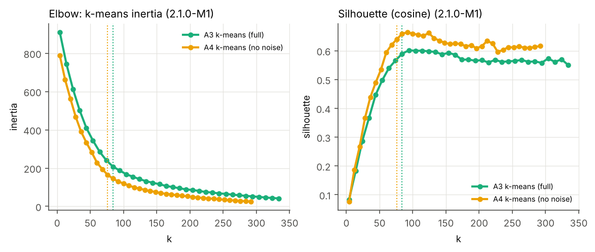

## 2.6 Quality metrics (3.5)

For a clustering into k clusters, with μᵢ the edges inside cluster i (size
Nᵢ) and εᵢⱼ the edges between clusters i and j (directed, unweighted graph):

* **Cohesion** – mean *intra-connectivity* Aᵢ = μᵢ / Nᵢ² (Mancoridis et al., 1998).
* **Coupling** – mean *inter-connectivity* Eᵢⱼ = εᵢⱼ / (2·Nᵢ·Nⱼ) over all pairs.
* **BasicMQ** = cohesion − coupling, in [−1, 1].
* **TurboMQ** = Σᵢ CFᵢ with CFᵢ = 2μᵢ / (2μᵢ + εᵢ), where εᵢ counts all edges
  crossing the border of cluster i (Mitchell & Mancoridis, 2006). TurboMQ
  grows with k, so we also report **TurboMQ/k**, the mean cluster factor in
  [0, 1], to compare clusterings with different k.
* **Intra deps** – the share of all dependencies that stay inside a cluster.
* **Stability** – adjusted Rand index (ARI) between the clusterings of two
  consecutive versions, over the classes present in both.

# 3. Results and discussion

## 3.1 Size and its evolution

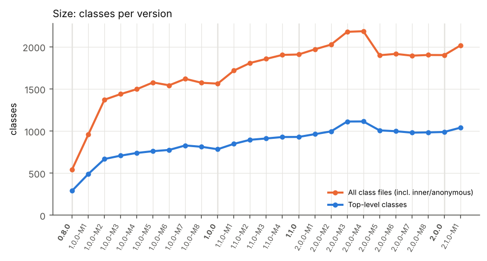

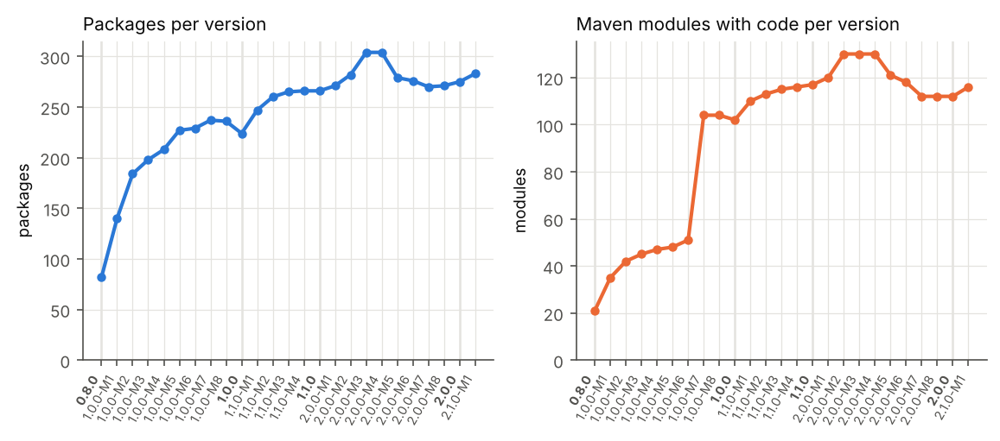

The system grew from **290 to 1,039 top-level classes (×3.6)** and from 543
to 2,015 class files in 31 months (Table 1, Figures 3–4). The growth is
**not uniform**:

* **0.8.0 → 1.0.0-M2 (×2.3 in 6 months):** the young framework adds model
  providers (Anthropic, Mistral, ZhiPu, MiniMax, Vertex Gemini, Watsonx, ...),
  vector stores (Cassandra, Elasticsearch, Qdrant, Redis, ...) and the
  `ChatClient`/advisor API (+198 classes in `spring-ai-core` in M2 alone).
* **1.0.0-M3 → 1.1.0 (slower, −4 % to +8 % per release):** consolidation
  before and after the first GA. **1.0.0-M8 → 1.0.0 even shrinks (−3.6 %)**: the
  RAG and chat-memory APIs were reworked and the Watsonx adapter removed for
  the GA.
* **2.0.0-M3 (+11.8 %):** the MCP annotation framework (+190 classes) is moved
  into Spring AI, and the Anthropic adapter is rewritten on the official SDK.
* **2.0.0-M5 (−9.5 %):** clean-up for the 2.0 GA. The OpenAI adapter is
  rewritten (−92 classes), and Azure OpenAI, Vertex AI Gemini and ZhiPu AI are
  removed (moved to the community organisation).

The **number of modules** shows a structural event the class count does
not. In **1.0.0-M7** the monolithic `spring-ai-core` (542 class files) and
`spring-ai-spring-boot-autoconfigure` (185) were split into `spring-ai-model`,
`-client-chat`, `-vector-store`, `-commons`, `-rag` and **one auto-configuration
module per provider/store**. The module count jumped from 51 to 104
(+57/−4 modules, Table 9), but the class count changed by only +7 %. It was a
**re-modularisation**, not a growth step.

**Lehman's laws.** *Continuing change (I)* and *continuing growth (VI)* are
clearly visible: 25 releases in 31 months, and every release adds or removes
modules (Table 9). Growth is fast in the first months and then slows down
to a few percent per release. This is the "inverse-square" shape that
Turski's model associates with the growing effort needed to understand an
ever-larger system, and it is consistent with *conservation of familiarity
(V)*: after 1.0 no release changes more than ~12 % of the system. The
size curve also shows *self-regulation (III)*: phases of expansion
(M1–M2, 1.1-M1–M2, 2.0-M2–M3) are followed by releases that shrink or
restructure the system (1.0.0, 2.0.0-M5…M7).

## 3.2 Class dependencies

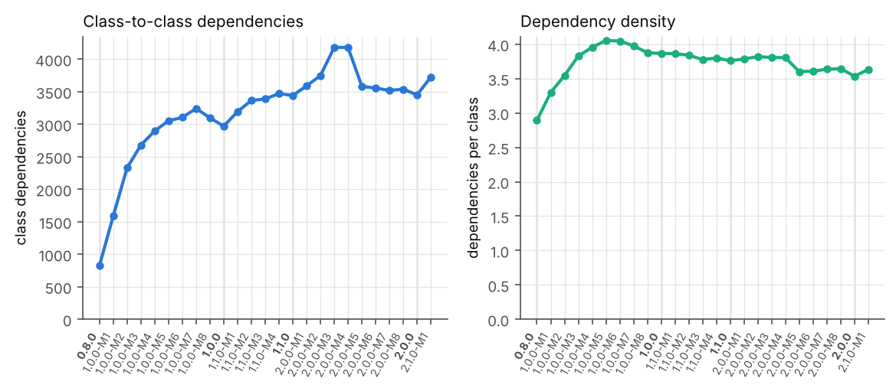

Dependencies grew from **827 to 3,725 (×4.5)**, faster than the classes
(×3.6). Density rose from 2.9 to **4.1 dependencies per class at 1.0.0-M6**,
the version just before the module split (Figure 5). From 1.0.0-M7 onwards
it **falls** to 3.6–4.0 and stays there, even though the system keeps
growing. This is *increasing complexity (II)* together with the
counter-measure the law predicts: complexity grows "unless work is done to
maintain or reduce it". The 1.0.0-M7 re-modularisation and the 2.0 clean-up
are exactly such *anti-regressive* work.

## 3.3 Widely-used (noise) classes

Table 3 – Noise classes (JNode) per version. *JNode-3/4 noise files* = class
files flagged by the original (3-decimal) and fixed (4-decimal) JNode;
*Top-30 fan-in flagged* = how many of the 30 most-used classes are noise.

| Version | Connected classes | Isolated | Noise (top-level) | Noise % | JNode-3 noise files | JNode-4 noise files | Jaccard 3 vs 4 | Top-30 fan-in flagged | Fallback |
|---|---|---|---|---|---|---|---|---|---|
| 0.8.0 | 284 | 2 | 21 | 7.39% | 0 | 0 | 1.0 | 13 | yes |
| 1.0.0-M1 | 479 | 4 | 95 | 19.83% | 201 | 199 | 0.99 | 29 |  |
| 1.0.0-M2 | 650 | 7 | 127 | 19.54% | 295 | 286 | 0.9695 | 30 |  |
| 1.0.0-M3 | 691 | 9 | 114 | 16.5% | 242 | 214 | 0.8843 | 30 |  |
| 1.0.0-M4 | 723 | 9 | 114 | 15.77% | 218 | 196 | 0.8991 | 30 |  |
| 1.0.0-M5 | 744 | 9 | 113 | 15.19% | 227 | 201 | 0.8855 | 30 |  |
| 1.0.0-M6 | 756 | 11 | 147 | 19.44% | 295 | 277 | 0.939 | 29 |  |
| 1.0.0-M7 | 804 | 11 | 72 | 8.96% | 129 | 130 | 0.9923 | 22 |  |
| 1.0.0-M8 | 787 | 12 | 77 | 9.78% | 139 | 141 | 0.9858 | 20 |  |
| 1.0.0 | 755 | 13 | 71 | 9.4% | 133 | 133 | 1.0 | 22 |  |
| 1.1.0-M1 | 814 | 13 | 91 | 11.18% | 161 | 161 | 1.0 | 21 |  |
| 1.1.0-M2 | 863 | 13 | 108 | 12.51% | 181 | 184 | 0.9837 | 24 |  |
| 1.1.0-M3 | 884 | 13 | 106 | 11.99% | 183 | 183 | 1.0 | 24 |  |
| 1.1.0-M4 | 901 | 13 | 108 | 11.99% | 198 | 198 | 1.0 | 24 |  |
| 1.1.0 | 901 | 14 | 111 | 12.32% | 199 | 200 | 0.995 | 24 |  |
| 2.0.0-M1 | 933 | 15 | 112 | 12.0% | 202 | 209 | 0.9665 | 24 |  |
| 2.0.0-M2 | 968 | 13 | 112 | 11.57% | 0 | 209 | 0.0 | 24 |  |
| 2.0.0-M3 | 1087 | 11 | 123 | 11.32% | 0 | 188 | 0.0 | 22 |  |
| 2.0.0-M4 | 1088 | 11 | 124 | 11.4% | 0 | 189 | 0.0 | 22 |  |
| 2.0.0-M5 | 986 | 9 | 125 | 12.68% | 192 | 193 | 0.9948 | 20 |  |
| 2.0.0-M6 | 976 | 9 | 123 | 12.6% | 193 | 193 | 1.0 | 21 |  |
| 2.0.0-M7 | 960 | 8 | 123 | 12.81% | 190 | 190 | 1.0 | 21 |  |
| 2.0.0-M8 | 963 | 8 | 126 | 13.08% | 194 | 194 | 1.0 | 21 |  |
| 2.0.0 | 966 | 10 | 112 | 11.59% | 180 | 180 | 1.0 | 15 |  |
| 2.1.0-M1 | 1016 | 10 | 116 | 11.42% | 0 | 188 | 0.0 | 16 |  |

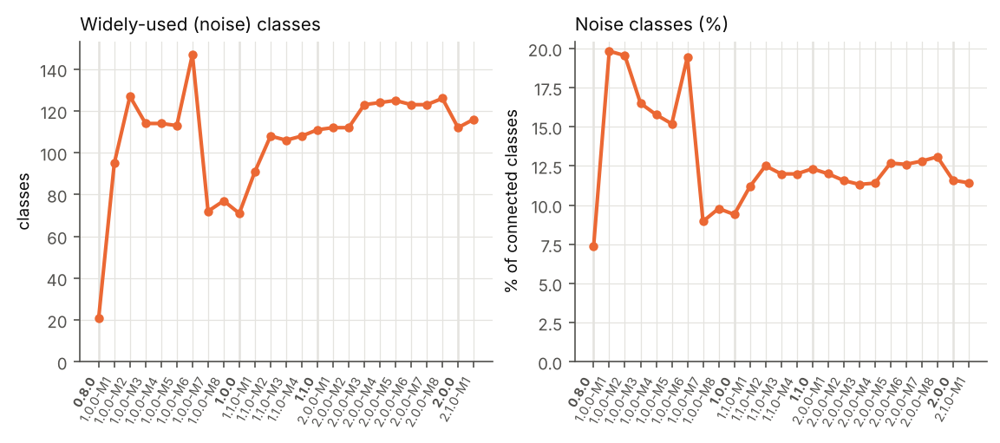

JNode flags **21–147 top-level classes (7–20 %)** per version. The noise
classes have a fan-in 3–9 times higher than the other classes (13.1 vs 2.4
on average, `results/noise_vs_fanin.csv`). In 0.8.0–1.0.0-M6 they are exactly
the classes one would call omnipresent: `Document`, `ModelRequest`,
`ModelResponse`, `ChatOptions`, `ModelOptionsUtils`, `Message`, `Filter`,
`EmbeddingModel`, `FunctionCallback` (29–30 of the 30 classes with the
highest fan-in).

Two observations need care:

1. **The share drops abruptly from 19 % to 9 % at 1.0.0-M7.** The core API
   classes are still widely used, but the module split changed the shape
   of the graph. JNode computes SIG only *inside the subgraph reachable from
   each class* and then normalises globally with mean + 1σ. After the split,
   the per-module auto-configuration classes reach long chains of classes;
   this presumably raises the mean SIG, so fewer classes exceed the
   threshold.
2. **In 2.x JNode drifts away from fan-in.** In 2.1.0-M1 only 16 of the 30
   most-used classes are flagged. `Document` (fan-in 71), `Filter` (61) and
   `EmbeddingModel` (47) are *not* flagged, while MCP transports (56 of the
   116 noise classes are in `mcp.*`) and Anthropic adapter classes are.
   JNode's notion of "noise" is a *reachability/significance* measure, not a
   usage count. It depends on how the classes are connected, and the 2.x MCP
   framework forms a large, densely connected subgraph. Removing these
   classes still helps the clustering (3.4), but the noise set of 2.x
   versions should not be read as "the utility classes of Spring AI".

## 3.4 Recovered architectures (A1–A4)

Table 4 – Mean over the 25 versions.

| Architecture | k | Largest cluster | Cohesion | Coupling | BasicMQ | TurboMQ | TurboMQ/k | Intra deps | ARI vs packages |
|---|---|---|---|---|---|---|---|---|---|
| A1 ACDC (full) | 109 | 61 | 0.2160 | 0.00212 | 0.2139 | 47.5 | 0.437 | 0.418 | 0.270 |
| A2 ACDC (no noise) | 107 | 51 | 0.2167 | 0.00140 | 0.2153 | 61.1 | 0.573 | 0.576 | 0.342 |
| A3 k-means (full) | 80 | 27 | 0.1371 | 0.00215 | 0.1349 | 41.9 | 0.528 | 0.332 | 0.268 |
| A4 k-means (no noise) | 72 | 23 | 0.1556 | 0.00108 | 0.1545 | 50.6 | 0.704 | 0.573 | 0.302 |
| Packages (full) | 242 | 22 | 0.1423 | 0.00312 | 0.1391 | 48.0 | 0.201 | 0.210 | 1.000 |
| Packages (no noise) | 210 | 18 | 0.1484 | 0.00265 | 0.1457 | 55.6 | 0.271 | 0.303 | 1.000 |

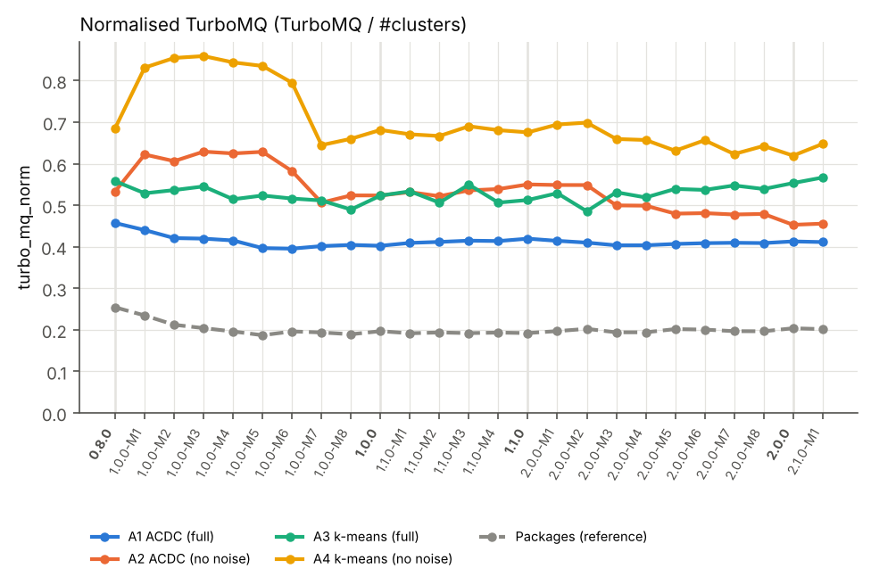

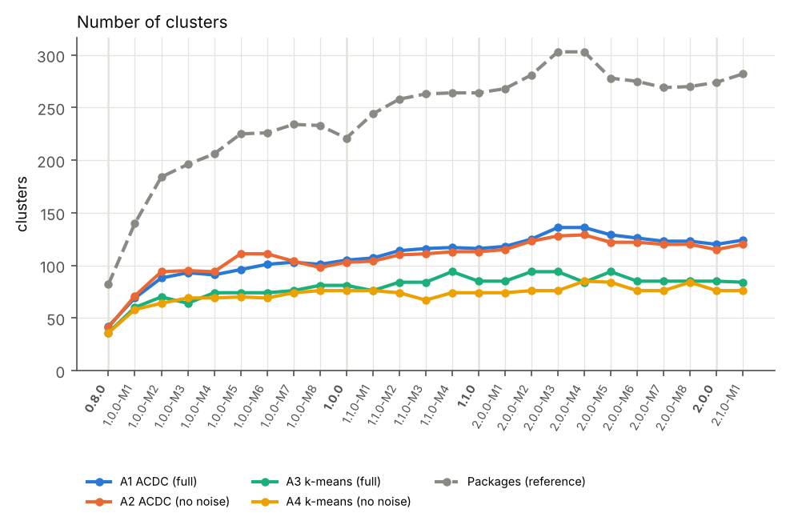

**Size of the recovered architectures.** ACDC produces 42 (0.8.0) to 124
(2.1.0-M1) clusters, k-means 36 to 84 (A3) / 76 (A4). ACDC's clusters are
less balanced: its largest cluster grows to 90 classes in 2.1.0-M1, whereas
k-means clusters never exceed 35 classes. ACDC never leaves a singleton
(OrphanAdoption assigns every orphan). The package decomposition has
~240 packages, 54 of them with a single class (Table 4).

**Quality.** In every version and for every metric, the algorithmic
architectures are **far more modular than the package structure**. On
average 42 % (A1) and 33 % (A3) of the dependencies stay inside a cluster,
against 21 % inside a package. TurboMQ/k is 0.44–0.70 vs 0.20. Spring AI's
packages are organised by *feature* (`chat.prompt`, `chat.messages`,
`chat.model`, ...) and by *vendor* (`openai`, `openai.api`, ...), and
features are used across packages. The recovery algorithms group classes
by *collaboration*.

* **ACDC vs k-means.** ACDC has the higher cohesion and BasicMQ (0.21 vs
  0.13–0.15) because its many small subgraph clusters are dense. k-means has
  the higher TurboMQ/k (0.53 vs 0.44 on the full graph) and fewer, more
  balanced clusters. ACDC keeps more dependencies inside clusters on the full
  graph (42 % vs 33 %), and both reach ~57 % without noise.
* **Effect of noise removal (A1→A2, A3→A4).** Removing the noise classes
  raises TurboMQ/k by **+0.14 (ACDC) and +0.18 (k-means)**, the intra-cluster
  share from 42 → 58 % and 33 → 57 %, and lowers coupling by 30–50 %. It also
  makes the clusterings more stable over time (3.5). Hub classes such as
  `Document` or `ChatOptions` connect almost every cluster to every other one;
  without them the true subsystems separate. The effect is strongest for
  1.0.0-M1…M6 (TurboMQ/k up to 0.86 for A4), where JNode removed ~19 % of the
  classes, and smaller after 1.0.0-M7 (fewer noise classes, see 3.3).

**ACDC parameters (tutorial suggestion).** Table 6 shows the experiment on
2.1.0-M1. (i) **BodyHeader has no effect**: `bso` and `so` give identical
results. (ii) **OrphanAdoption is essential**: without it, ACDC's last step
(ClusterLast) puts all unclustered classes into one cluster of 406 classes,
and TurboMQ/k drops from 0.47 to 0.35. (iii) The **maximum cluster size**
matters only below 20: 5 gives 146 smaller clusters with lower TurboMQ/k
(0.44), and ≥ 20 gives the same result. We therefore kept the default (20, `bso`).


Table 6 – ACDC parameter experiment (2.1.0-M1).

| Graph | Patterns | Max size | k | Largest | TurboMQ/k | Intra deps |
|---|---|---|---|---|---|---|
| full | bso | 5 | 146 | 57 | 0.4405 | 0.4379 |
| full | bso | 10 | 129 | 57 | 0.4624 | 0.4545 |
| full | bso | 20 | 124 | 90 | 0.4672 | 0.4725 |
| full | bso | 40 | 124 | 90 | 0.4664 | 0.4749 |
| full | bso | 80 | 124 | 90 | 0.4664 | 0.4749 |
| full | so | 5 | 146 | 57 | 0.4405 | 0.4379 |
| full | so | 10 | 129 | 57 | 0.4624 | 0.4545 |
| full | so | 20 | 124 | 90 | 0.4672 | 0.4725 |
| full | so | 40 | 124 | 90 | 0.4664 | 0.4749 |
| full | so | 80 | 124 | 90 | 0.4664 | 0.4749 |
| full | bs | 5 | 146 | 406 | 0.33 | 0.3866 |
| full | bs | 10 | 129 | 406 | 0.3484 | 0.3962 |
| full | bs | 20 | 124 | 406 | 0.352 | 0.4035 |
| full | bs | 40 | 124 | 406 | 0.3522 | 0.4059 |
| full | bs | 80 | 124 | 406 | 0.3522 | 0.4059 |
| nonoise | bso | 5 | 139 | 39 | 0.4886 | 0.4961 |
| nonoise | bso | 10 | 123 | 49 | 0.5178 | 0.517 |
| nonoise | bso | 20 | 120 | 68 | 0.5165 | 0.5259 |
| nonoise | bso | 40 | 120 | 68 | 0.5165 | 0.5259 |
| nonoise | bso | 80 | 120 | 68 | 0.5165 | 0.5259 |
| nonoise | so | 5 | 139 | 39 | 0.4886 | 0.4961 |
| nonoise | so | 10 | 123 | 49 | 0.5178 | 0.517 |
| nonoise | so | 20 | 120 | 68 | 0.5165 | 0.5259 |
| nonoise | so | 40 | 120 | 68 | 0.5165 | 0.5259 |
| nonoise | so | 80 | 120 | 68 | 0.5165 | 0.5259 |
| nonoise | bs | 5 | 139 | 299 | 0.3867 | 0.3703 |
| nonoise | bs | 10 | 123 | 299 | 0.4125 | 0.3834 |
| nonoise | bs | 20 | 120 | 299 | 0.4122 | 0.39 |
| nonoise | bs | 40 | 120 | 299 | 0.4122 | 0.39 |
| nonoise | bs | 80 | 120 | 299 | 0.4122 | 0.39 |

## 3.5 Quality of the architecture over time

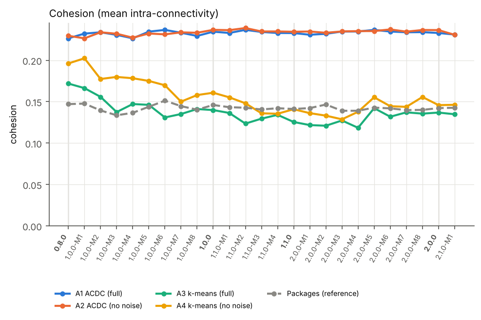

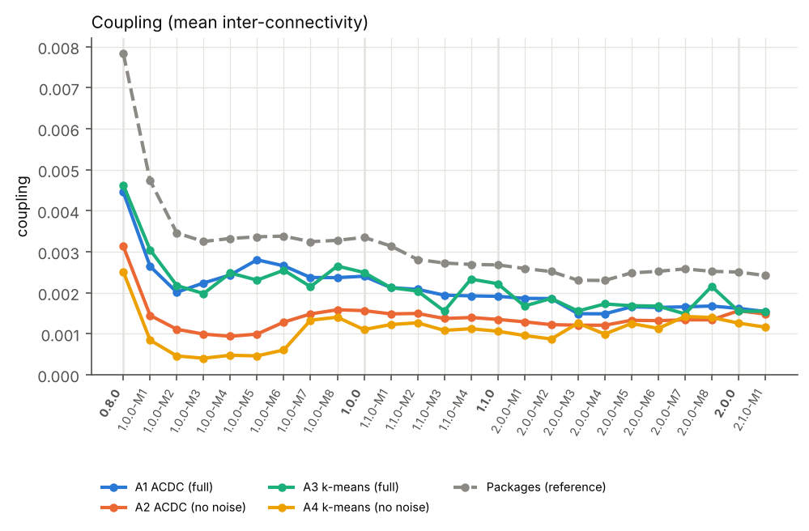

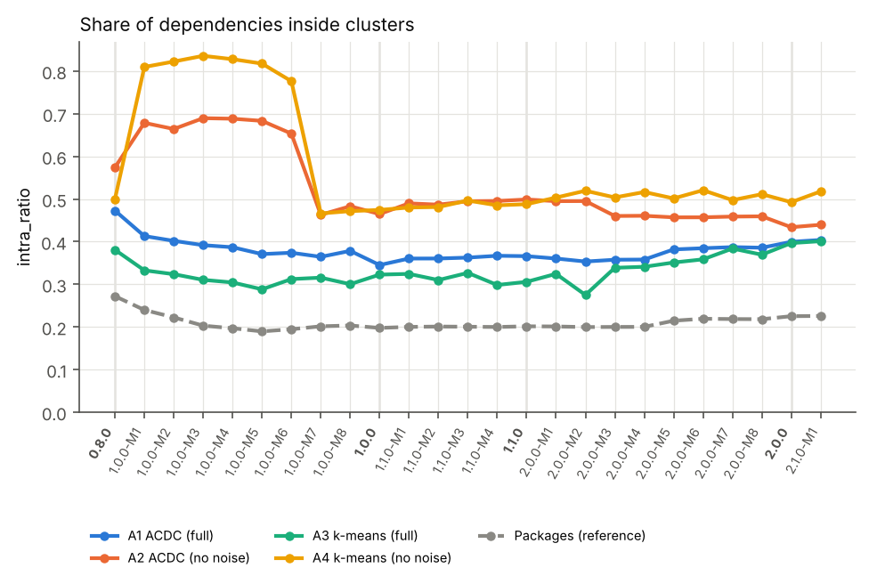

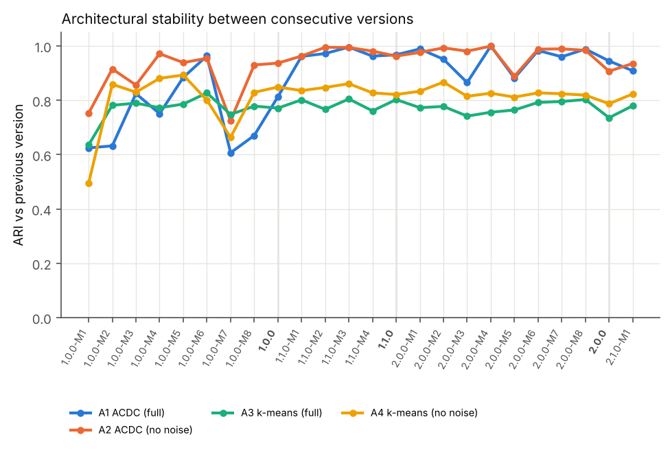

The evolution of the metrics (Tables 5, 7, 8; Figures 7, 10–13) tells a
consistent story in three phases:

1. **0.8.0 → 1.0.0-M6 – erosion during fast growth.** The modularity of the
   full system decreases: ACDC TurboMQ/k falls from 0.49 to 0.41, the
   package decomposition from 0.25 to 0.19, and the intra-cluster share of
   A1 from 0.49 to 0.38. More and more classes depend on a growing set of
   core abstractions, which is *declining quality (VII)* while new features
   are added quickly. The architectures are also unstable between releases
   (A1 ARI 0.64–0.88 for M1–M5): new features are not only added but
   re-wired.
2. **1.0.0-M7 → 1.0.0 – restructuring.** The module split is the largest
   architectural change in the history (A1 ARI 0.65 vs 1.0.0-M6). After it,
   the noise-free architectures (A2, A4) lose quality (A2 0.62 → 0.52)
   because fewer hub classes are removed (3.3). The full-graph architectures
   stay at their level.
3. **1.1.0-M1 → 2.1.0-M1 – stable, slowly improving.** ACDC TurboMQ/k rises
   from 0.42 to 0.47, k-means from 0.53 to 0.57, and coupling falls
   (A1 0.0024 in 1.0.0 → 0.0015). ACDC architectures are **very stable** between
   releases (ARI 0.94–1.00 for A2 between 1.0.0 and 2.0.0-M4). The visible
   dips are 2.0.0-M3 (MCP annotations) and 2.0.0-M5 (provider removals).
   Despite +33 % classes since 1.0.0, quality did not decline. The clean-up
   releases kept the architecture in shape.

Overall, Lehman's *declining quality* law holds only for the early,
fast-growing phase. After 1.0 the project counteracts it with explicit
restructuring, enforced module rules (design doc 02) and removal of
adapters, so quality is stable or improves slightly.

**Stability of the methods.** ACDC is clearly more stable than k-means (mean
ARI 0.89/0.93 for A1/A2 vs 0.77/0.81 for A3/A4). ACDC's patterns are
deterministic and local, so a release changes only the clusters it touches.
k-means re-partitions the whole space whenever k or the embedding changes.
For evolution studies ACDC therefore gives more interpretable diffs.

# 4. Architecture recovery with AI (latest version, 2.1.0-M1)

**Tool and protocol.** We used **Claude (Anthropic)** through Claude Code.
We wrote four prompts with increasing context (all prompts, inputs and
verbatim responses are in `ai/`):

| Prompt | Information given |
|---|---|
| P1 | Only the name/version and the GitHub URL |
| P2 | README of 2.1.0-M1 + list of the 116 Maven modules with their number of classes (`ai/inputs/modules.md`) |
| P3 | P2 + all 283 packages with class counts and sample classes (`packages.md`) + the package dependency graph from DependencyExtractor (1,047 weighted edges, `package_deps.md`); the answer had to map **every package to exactly one component** as ordered regex rules in JSON |
| P4 | Follow-up: the metrics of the P3 architecture compared with ACDC/k-means, asking for an explanation and possible improvements |

Limitation: the same assistant also helped to build the pipeline and had
therefore seen the analysis data. The P1 answer is thus not a fully
"cold" answer. Re-running the prompts in ChatGPT or another tool would give
an independent comparison.

**What the AI produced.**

* **P1 (no context)**: a plausible 14-component layered architecture
  (commons, chat/other model APIs, ChatClient & advisors, structured output,
  tools, memory, RAG/ETL, vector store API and implementations, providers,
  MCP, observability, Boot auto-configuration) with the right styles
  (*Ports & Adapters*, plug-in auto-configuration, *Chain of Responsibility*
  for advisors). But it is generic and partly **outdated**: it lists Azure
  OpenAI, Vertex AI Gemini, Hugging Face and `spring-ai-core`, all of which no
  longer exist in 2.1.0-M1 (removed in 1.0.0-M7, 2.0.0-M3 and 2.0.0-M5). It
  says it is unsure about exactly these points.
* **P2 (README + modules)**: 13 components in 5 layers (Foundation → Core
  abstractions → Application services → Adapters → Spring Boot integration)
  with an exact module-to-component mapping. It also identified real smells:
  `spring-ai-model` as a large "kernel" (346 class files), MCP annotations as
  a second large subsystem (224), and 57 auto-configuration modules.
* **P3 (packages + dependency graph)**: 12 components with an explicit
  package mapping (`ai/ai_architecture_P3.json`), a layered diagram derived
  from the measured dependencies, the strongest component dependencies
  (Model providers → Model API: 516; Vector stores → Vector store API: 190),
  three small cycles (Model API ⇄ Commons ⇄ Tool calling) and the hub
  packages (`document`, `embedding`, `vectorstore`, `model`, observation
  conventions).

Table 10 – Components of the AI architecture (P3) – classes with at least one dependency.

| Component | Classes |
|---|---|
| Boot auto-configuration | 214 |
| MCP | 163 |
| Model API (chat, embedding, image, audio, moderation) | 157 |
| Model providers | 147 |
| Vector store implementations | 62 |
| Tool calling & tool search | 58 |
| ChatClient & Advisors | 55 |
| Commons & infrastructure | 45 |
| RAG & ETL | 39 |
| Vector store API & filter language | 29 |
| Chat memory repositories | 24 |
| Dev services (Docker Compose / Testcontainers) | 23 |

Table 11 – AI (P3) architecture vs algorithmic architectures (2.1.0-M1).

| Architecture (2.1.0-M1) | k | Largest | Cohesion | Coupling | BasicMQ | TurboMQ | TurboMQ/k | Intra deps |
|---|---|---|---|---|---|---|---|---|
| AI (P3), full | 12 | 214 | 0.02836 | 0.002618 | 0.02574 | 5.48 | 0.4567 | 0.4722 |
| AI (P3), no noise | 12 | 174 | 0.02801 | 0.00229 | 0.02572 | 6.295 | 0.5246 | 0.5236 |
| A1 ACDC | 124 | 90 | 0.2061 | 0.001544 | 0.20456 | 57.938 | 0.4672 | 0.4725 |
| A2 ACDC−noise | 120 | 68 | 0.20545 | 0.001483 | 0.20396 | 61.974 | 0.5165 | 0.5259 |
| A3 k-means | 84 | 32 | 0.13482 | 0.001548 | 0.13327 | 47.6 | 0.5667 | 0.4011 |
| A4 k-means−noise | 76 | 28 | 0.14621 | 0.001163 | 0.14505 | 49.218 | 0.6476 | 0.5178 |
| Packages | 282 | 19 | 0.14263 | 0.002421 | 0.14021 | 56.873 | 0.2017 | 0.2258 |

Table 12 – Agreement (ARI) of the AI architecture with the other architectures.

|  | A1 | A2 | A3 | A4 | Packages |
|---|---|---|---|---|---|
| AI (full) | 0.0879 | 0.1001 | 0.0888 | 0.109 | 0.0688 |
| AI (no noise) | 0.1073 | 0.1001 | 0.1117 | 0.109 | 0.0791 |

# 5. Reflection

## 5.1 Comparing the architectures of the latest version

* **Granularity.** The AI architecture has **12 components**, ACDC 124
  clusters, k-means 84, the package structure 282 packages. Only the AI
  architecture is at the level of abstraction an architect would draw on a
  whiteboard. The algorithmic architectures are closer to "modules of
  collaborating classes" and would need a second, hierarchical step to be read
  as components.
* **Quality metrics.** With 10× fewer components, the AI architecture keeps
  **the same share of dependencies inside components as ACDC (47.2 % vs
  47.3 %)**, and its TurboMQ/k is almost the same (0.457 vs 0.467). k-means
  is better on TurboMQ/k (0.567) and k-means without noise is best (0.648).
  Cohesion and BasicMQ are much lower for the AI (0.028 vs 0.21) only
  because intra-connectivity divides by Nᵢ²: large components can never be
  dense. These metrics are not comparable across very different k.
* **Agreement.** The AI architecture agrees very little with all algorithmic
  architectures (ARI ≈ 0.09–0.11) and even with the packages (0.07; ARI is
  low when the numbers of groups differ so much). ACDC and k-means agree with
  each other only moderately (ARI 0.30 for A1 vs A3, 0.35 for A2 vs A4), and
  each agrees with the packages at ARI ≈ 0.25–0.30.
* **Different principles.** The AI groups by **responsibility and
  architectural role**. All provider adapters form one component, all
  vector-store adapters another, all auto-configuration a third. The
  algorithms group by **connectivity**: each adapter ends up next to the
  ports it uses most (an OpenAI cluster with its options, API client and
  auto-configuration). The AI's decomposition makes the *Ports & Adapters*
  style visible: the strongest inter-component dependencies are adapter → port
  by design. The algorithmic decompositions show *vertical slices* (feature
  or vendor) that are easier to change in isolation. Both are valid views:
  the AI's answers "what are the parts and their roles?", the algorithms
  answer "what changes together / depends together?".

**Our assessment.** For understanding and documenting the system, the AI
architecture (P3) is the most useful. It is correct with respect to the
code (every package is mapped, the dependency directions are measured), it
matches the documented intent (design doc 02), and it names its own weak
points. ACDC is the best fully automatic method for *tracking evolution*
because it is stable and deterministic. k-means gives the best modularity
numbers but depends on k and on the embedding, and its clusters change most
between versions.

## 5.2 Does the AI tool help? How do information and prompts influence the result?

* **It helps a lot, but only when given facts.** P1 is a fluent but generic
  answer that mixes the 1.x and 2.x code bases and names removed modules: a
  typical *hallucination by outdated training data*. Adding the module list
  (P2) fixed the component inventory. Adding packages and the measured
  dependency graph (P3) made the answer **verifiable and quantitative**:
  a complete package mapping, real dependency weights, real cycles.
* **The prompt shapes the result.** Asking for "8–15 components" fixed the
  granularity. Asking for a mapping in machine-readable form (ordered regex
  rules) forced completeness and let us evaluate the AI architecture with the
  same metrics as ACDC/k-means. Feeding the metrics back (P4) produced a
  reasoned answer: it explained the effect of granularity on the metrics and
  proposed refinements (split MCP into annotations vs transports, split
  auto-configuration by target, move observability into its own component)
  without giving up the port/adapter boundary.
* **Risks.** The AI does not compute anything on its own; it reasons over
  what it is given. Without the extracted facts, the result cannot be checked,
  and even with them, a claim like "small cycles" must be verified (we did,
  `results/ai_component_deps.csv`). The output also depends on the model
  version and on the conversation, so it is not reproducible in a strict
  sense.

## 5.3 Which method for other systems?

For other systems and many versions we would **combine** the methods: run
the deterministic pipeline (DependencyExtractor → noise removal → ACDC) on
every version for *evolution* and *metrics*, and use an AI tool on the
**latest** version, *given the extracted facts* (modules, packages, the
dependency graph and the ACDC clusters), to produce a named, layered
component view and to explain the algorithmic clusters. AI alone is
fast but unverifiable and possibly outdated. Algorithms alone are
reproducible but produce clusters that still need a human (or an AI) to name
and abstract them. Noise removal should always be applied, but the noise
set should be sanity-checked (e.g. against fan-in, as in 3.3), because
JNode's SIG measure depends on the graph's shape.

# 6. Threats to validity

* **Binary vs source.** We analyse published jars, so only compiled
  dependencies are seen (no reflection, Spring wiring by configuration,
  service loading or annotations processed at run time).
* **System boundary.** The BOM defines the system. Modules not in the BOM
  (e.g. integration tests, docs) are not analysed. Duplicated split-package
  classes are kept once.
* **Tool changes.** JNode had to be patched (performance, identical output;
  precision, Jaccard ≥ 0.88 with the original where it worked), and 0.8.0 needed
  a threshold fallback. ACDC is a third-party port, not the York original.
* **k-means.** The results depend on the feature representation (dependency
  profiles + SVD) and on the elbow choice of k. The silhouette would pick
  much finer clusterings (Figure 2).
* **Metrics.** Cohesion/BasicMQ and TurboMQ depend strongly on k; we report
  TurboMQ/k and the intra-cluster share as the main comparable measures.
* **Milestones as versions** (see 1.2).

# References

* Mancoridis S., Mitchell B. S., Rorres C., Chen Y., Gansner E. R. (1998). *Using Automatic Clustering to Produce High-Level System Organizations of Source Code.* IWPC.
* Mitchell B. S., Mancoridis S. (2006). *On the automatic modularization of software systems using the Bunch tool.* IEEE TSE 32(3).
* Tzerpos V., Holt R. C. (2000). *ACDC: An Algorithm for Comprehension-Driven Clustering.* WCRE.
* Lehman M. M. (1980/1996). *Laws of Software Evolution Revisited.* EWSPT.
* Turski W. M. (1996). *Reference model for smooth growth of software systems.* IEEE TSE 22(8).
* Satopää V. et al. (2011). *Finding a "Kneedle" in a Haystack.* ICDCSW.
* Spring AI reference documentation and `design/02-boot-modularity.adoc`, v2.1.0-M1.

# Appendix A – Full metric tables

Table 5 – Number of clusters (k).

| Version | A1 ACDC | A2 ACDC−noise | A3 k-means | A4 k-means−noise | Packages |
|---|---|---|---|---|---|
| 0.8.0 | 42 | 41 | 36 | 36 | 82 |
| 1.0.0-M1 | 69 | 71 | 60 | 58 | 140 |
| 1.0.0-M2 | 88 | 94 | 70 | 64 | 184 |
| 1.0.0-M3 | 93 | 95 | 64 | 69 | 196 |
| 1.0.0-M4 | 91 | 94 | 74 | 69 | 206 |
| 1.0.0-M5 | 96 | 111 | 74 | 70 | 225 |
| 1.0.0-M6 | 101 | 111 | 74 | 69 | 226 |
| 1.0.0-M7 | 103 | 104 | 76 | 74 | 234 |
| 1.0.0-M8 | 101 | 98 | 81 | 76 | 233 |
| 1.0.0 | 105 | 103 | 81 | 76 | 221 |
| 1.1.0-M1 | 107 | 104 | 76 | 76 | 244 |
| 1.1.0-M2 | 114 | 110 | 84 | 74 | 258 |
| 1.1.0-M3 | 116 | 111 | 84 | 67 | 263 |
| 1.1.0-M4 | 117 | 113 | 94 | 74 | 264 |
| 1.1.0 | 116 | 113 | 85 | 74 | 264 |
| 2.0.0-M1 | 118 | 115 | 85 | 74 | 268 |
| 2.0.0-M2 | 125 | 123 | 94 | 76 | 281 |
| 2.0.0-M3 | 136 | 128 | 94 | 76 | 303 |
| 2.0.0-M4 | 136 | 129 | 84 | 85 | 303 |
| 2.0.0-M5 | 129 | 122 | 94 | 84 | 278 |
| 2.0.0-M6 | 126 | 122 | 85 | 76 | 275 |
| 2.0.0-M7 | 123 | 120 | 85 | 76 | 269 |
| 2.0.0-M8 | 123 | 120 | 85 | 84 | 270 |
| 2.0.0 | 120 | 115 | 85 | 76 | 274 |
| 2.1.0-M1 | 124 | 120 | 84 | 76 | 282 |

Table 7 – TurboMQ/k (normalised TurboMQ).

| Version | A1 ACDC | A2 ACDC−noise | A3 k-means | A4 k-means−noise | Packages |
|---|---|---|---|---|---|
| 0.8.0 | 0.495 | 0.586 | 0.558 | 0.686 | 0.254 |
| 1.0.0-M1 | 0.465 | 0.673 | 0.529 | 0.831 | 0.235 |
| 1.0.0-M2 | 0.442 | 0.645 | 0.536 | 0.855 | 0.212 |
| 1.0.0-M3 | 0.435 | 0.674 | 0.545 | 0.859 | 0.204 |
| 1.0.0-M4 | 0.430 | 0.679 | 0.514 | 0.844 | 0.196 |
| 1.0.0-M5 | 0.410 | 0.665 | 0.523 | 0.835 | 0.187 |
| 1.0.0-M6 | 0.411 | 0.615 | 0.516 | 0.795 | 0.196 |
| 1.0.0-M7 | 0.413 | 0.522 | 0.511 | 0.645 | 0.194 |
| 1.0.0-M8 | 0.412 | 0.527 | 0.490 | 0.660 | 0.189 |
| 1.0.0 | 0.410 | 0.528 | 0.523 | 0.681 | 0.197 |
| 1.1.0-M1 | 0.421 | 0.539 | 0.533 | 0.671 | 0.192 |
| 1.1.0-M2 | 0.420 | 0.532 | 0.506 | 0.667 | 0.194 |
| 1.1.0-M3 | 0.428 | 0.549 | 0.550 | 0.690 | 0.192 |
| 1.1.0-M4 | 0.425 | 0.547 | 0.506 | 0.681 | 0.193 |
| 1.1.0 | 0.428 | 0.559 | 0.513 | 0.675 | 0.192 |
| 2.0.0-M1 | 0.426 | 0.561 | 0.529 | 0.694 | 0.197 |
| 2.0.0-M2 | 0.420 | 0.560 | 0.485 | 0.699 | 0.202 |
| 2.0.0-M3 | 0.444 | 0.556 | 0.531 | 0.659 | 0.194 |
| 2.0.0-M4 | 0.444 | 0.554 | 0.519 | 0.657 | 0.194 |
| 2.0.0-M5 | 0.450 | 0.549 | 0.539 | 0.631 | 0.202 |
| 2.0.0-M6 | 0.455 | 0.553 | 0.537 | 0.656 | 0.201 |
| 2.0.0-M7 | 0.456 | 0.553 | 0.548 | 0.623 | 0.197 |
| 2.0.0-M8 | 0.455 | 0.552 | 0.539 | 0.643 | 0.197 |
| 2.0.0 | 0.472 | 0.520 | 0.553 | 0.619 | 0.204 |
| 2.1.0-M1 | 0.467 | 0.516 | 0.567 | 0.648 | 0.202 |

Table 7b – TurboMQ.

| Version | A1 ACDC | A2 ACDC−noise | A3 k-means | A4 k-means−noise | Packages |
|---|---|---|---|---|---|
| 0.8.0 | 20.8 | 24.0 | 20.1 | 24.7 | 20.8 |
| 1.0.0-M1 | 32.1 | 47.8 | 31.7 | 48.2 | 32.9 |
| 1.0.0-M2 | 38.9 | 60.7 | 37.6 | 54.7 | 39.0 |
| 1.0.0-M3 | 40.4 | 64.0 | 34.9 | 59.3 | 40.0 |
| 1.0.0-M4 | 39.1 | 63.8 | 38.1 | 58.2 | 40.4 |
| 1.0.0-M5 | 39.3 | 73.8 | 38.7 | 58.5 | 42.1 |
| 1.0.0-M6 | 41.5 | 68.3 | 38.2 | 54.8 | 44.3 |
| 1.0.0-M7 | 42.6 | 54.3 | 38.9 | 47.7 | 45.3 |
| 1.0.0-M8 | 41.6 | 51.7 | 39.7 | 50.2 | 44.1 |
| 1.0.0 | 43.1 | 54.4 | 42.4 | 51.8 | 43.5 |
| 1.1.0-M1 | 45.0 | 56.1 | 40.5 | 51.0 | 46.8 |
| 1.1.0-M2 | 47.9 | 58.5 | 42.5 | 49.3 | 50.0 |
| 1.1.0-M3 | 49.6 | 61.0 | 46.2 | 46.2 | 50.5 |
| 1.1.0-M4 | 49.7 | 61.9 | 47.6 | 50.4 | 51.1 |
| 1.1.0 | 49.6 | 63.2 | 43.6 | 50.0 | 50.7 |
| 2.0.0-M1 | 50.3 | 64.5 | 45.0 | 51.4 | 52.8 |
| 2.0.0-M2 | 52.5 | 68.9 | 45.6 | 53.1 | 56.9 |
| 2.0.0-M3 | 60.4 | 71.1 | 49.9 | 50.1 | 58.8 |
| 2.0.0-M4 | 60.4 | 71.5 | 43.6 | 55.9 | 58.8 |
| 2.0.0-M5 | 58.0 | 67.0 | 50.7 | 53.0 | 56.1 |
| 2.0.0-M6 | 57.3 | 67.5 | 45.6 | 49.9 | 55.2 |
| 2.0.0-M7 | 56.1 | 66.4 | 46.5 | 47.4 | 52.9 |
| 2.0.0-M8 | 55.9 | 66.3 | 45.8 | 54.0 | 53.1 |
| 2.0.0 | 56.7 | 59.8 | 47.0 | 47.1 | 55.8 |
| 2.1.0-M1 | 57.9 | 62.0 | 47.6 | 49.2 | 56.9 |

Table 7c – BasicMQ.

| Version | A1 ACDC | A2 ACDC−noise | A3 k-means | A4 k-means−noise | Packages |
|---|---|---|---|---|---|
| 0.8.0 | 0.1993 | 0.2054 | 0.1673 | 0.1936 | 0.1392 |
| 1.0.0-M1 | 0.2136 | 0.2114 | 0.1633 | 0.2016 | 0.1429 |
| 1.0.0-M2 | 0.2188 | 0.2209 | 0.1536 | 0.1769 | 0.1360 |
| 1.0.0-M3 | 0.2165 | 0.2132 | 0.1355 | 0.1795 | 0.1303 |
| 1.0.0-M4 | 0.2078 | 0.2101 | 0.1447 | 0.1778 | 0.1332 |
| 1.0.0-M5 | 0.2189 | 0.2233 | 0.1438 | 0.1746 | 0.1405 |
| 1.0.0-M6 | 0.2208 | 0.2240 | 0.1284 | 0.1692 | 0.1478 |
| 1.0.0-M7 | 0.2212 | 0.2194 | 0.1329 | 0.1487 | 0.1414 |
| 1.0.0-M8 | 0.2178 | 0.2172 | 0.1384 | 0.1566 | 0.1371 |
| 1.0.0 | 0.2245 | 0.2223 | 0.1374 | 0.1597 | 0.1426 |
| 1.1.0-M1 | 0.2193 | 0.2230 | 0.1342 | 0.1540 | 0.1402 |
| 1.1.0-M2 | 0.2201 | 0.2211 | 0.1215 | 0.1468 | 0.1399 |
| 1.1.0-M3 | 0.2173 | 0.2160 | 0.1280 | 0.1349 | 0.1379 |
| 1.1.0-M4 | 0.2181 | 0.2168 | 0.1318 | 0.1343 | 0.1394 |
| 1.1.0 | 0.2145 | 0.2132 | 0.1232 | 0.1398 | 0.1385 |
| 2.0.0-M1 | 0.2130 | 0.2114 | 0.1200 | 0.1352 | 0.1396 |
| 2.0.0-M2 | 0.2113 | 0.2109 | 0.1191 | 0.1322 | 0.1440 |
| 2.0.0-M3 | 0.2120 | 0.2106 | 0.1257 | 0.1274 | 0.1367 |
| 2.0.0-M4 | 0.2120 | 0.2113 | 0.1167 | 0.1368 | 0.1367 |
| 2.0.0-M5 | 0.2113 | 0.2145 | 0.1405 | 0.1540 | 0.1404 |
| 2.0.0-M6 | 0.2099 | 0.2175 | 0.1301 | 0.1434 | 0.1394 |
| 2.0.0-M7 | 0.2085 | 0.2172 | 0.1356 | 0.1423 | 0.1373 |
| 2.0.0-M8 | 0.2087 | 0.2162 | 0.1334 | 0.1542 | 0.1375 |
| 2.0.0 | 0.2068 | 0.2108 | 0.1353 | 0.1446 | 0.1398 |
| 2.1.0-M1 | 0.2046 | 0.2040 | 0.1333 | 0.1451 | 0.1402 |

Table 8a – Cohesion (mean intra-connectivity).

| Version | A1 ACDC | A2 ACDC−noise | A3 k-means | A4 k-means−noise | Packages |
|---|---|---|---|---|---|
| 0.8.0 | 0.2038 | 0.2086 | 0.1719 | 0.1962 | 0.1470 |
| 1.0.0-M1 | 0.2162 | 0.2128 | 0.1664 | 0.2024 | 0.1477 |
| 1.0.0-M2 | 0.2208 | 0.2220 | 0.1558 | 0.1774 | 0.1394 |
| 1.0.0-M3 | 0.2188 | 0.2142 | 0.1374 | 0.1799 | 0.1336 |
| 1.0.0-M4 | 0.2102 | 0.2110 | 0.1472 | 0.1783 | 0.1365 |
| 1.0.0-M5 | 0.2217 | 0.2243 | 0.1461 | 0.1751 | 0.1439 |
| 1.0.0-M6 | 0.2235 | 0.2253 | 0.1310 | 0.1698 | 0.1512 |
| 1.0.0-M7 | 0.2236 | 0.2209 | 0.1351 | 0.1500 | 0.1446 |
| 1.0.0-M8 | 0.2201 | 0.2187 | 0.1411 | 0.1580 | 0.1403 |
| 1.0.0 | 0.2269 | 0.2238 | 0.1399 | 0.1608 | 0.1460 |
| 1.1.0-M1 | 0.2214 | 0.2245 | 0.1363 | 0.1552 | 0.1433 |
| 1.1.0-M2 | 0.2222 | 0.2226 | 0.1235 | 0.1480 | 0.1427 |
| 1.1.0-M3 | 0.2192 | 0.2174 | 0.1295 | 0.1359 | 0.1406 |
| 1.1.0-M4 | 0.2200 | 0.2182 | 0.1341 | 0.1354 | 0.1421 |
| 1.1.0 | 0.2164 | 0.2146 | 0.1255 | 0.1409 | 0.1412 |
| 2.0.0-M1 | 0.2149 | 0.2127 | 0.1217 | 0.1361 | 0.1422 |
| 2.0.0-M2 | 0.2132 | 0.2121 | 0.1209 | 0.1331 | 0.1465 |
| 2.0.0-M3 | 0.2135 | 0.2118 | 0.1273 | 0.1287 | 0.1390 |
| 2.0.0-M4 | 0.2135 | 0.2125 | 0.1184 | 0.1378 | 0.1390 |
| 2.0.0-M5 | 0.2130 | 0.2158 | 0.1421 | 0.1553 | 0.1429 |
| 2.0.0-M6 | 0.2115 | 0.2188 | 0.1318 | 0.1445 | 0.1419 |
| 2.0.0-M7 | 0.2102 | 0.2185 | 0.1371 | 0.1437 | 0.1398 |
| 2.0.0-M8 | 0.2104 | 0.2176 | 0.1356 | 0.1557 | 0.1401 |
| 2.0.0 | 0.2084 | 0.2124 | 0.1368 | 0.1458 | 0.1422 |
| 2.1.0-M1 | 0.2061 | 0.2054 | 0.1348 | 0.1462 | 0.1426 |

Table 8b – Coupling (mean inter-connectivity).

| Version | A1 ACDC | A2 ACDC−noise | A3 k-means | A4 k-means−noise | Packages |
|---|---|---|---|---|---|
| 0.8.0 | 0.00446 | 0.00313 | 0.00463 | 0.00251 | 0.00784 |
| 1.0.0-M1 | 0.00265 | 0.00145 | 0.00305 | 0.00085 | 0.00474 |
| 1.0.0-M2 | 0.00201 | 0.00111 | 0.00218 | 0.00046 | 0.00346 |
| 1.0.0-M3 | 0.00224 | 0.00099 | 0.00198 | 0.00040 | 0.00325 |
| 1.0.0-M4 | 0.00244 | 0.00094 | 0.00248 | 0.00048 | 0.00332 |
| 1.0.0-M5 | 0.00280 | 0.00099 | 0.00231 | 0.00046 | 0.00336 |
| 1.0.0-M6 | 0.00266 | 0.00128 | 0.00255 | 0.00061 | 0.00338 |
| 1.0.0-M7 | 0.00237 | 0.00148 | 0.00215 | 0.00133 | 0.00325 |
| 1.0.0-M8 | 0.00237 | 0.00159 | 0.00265 | 0.00140 | 0.00328 |
| 1.0.0 | 0.00240 | 0.00156 | 0.00249 | 0.00110 | 0.00335 |
| 1.1.0-M1 | 0.00213 | 0.00149 | 0.00213 | 0.00123 | 0.00314 |
| 1.1.0-M2 | 0.00208 | 0.00150 | 0.00204 | 0.00127 | 0.00281 |
| 1.1.0-M3 | 0.00194 | 0.00137 | 0.00155 | 0.00108 | 0.00273 |
| 1.1.0-M4 | 0.00193 | 0.00140 | 0.00233 | 0.00112 | 0.00269 |
| 1.1.0 | 0.00191 | 0.00135 | 0.00222 | 0.00106 | 0.00268 |
| 2.0.0-M1 | 0.00186 | 0.00129 | 0.00168 | 0.00096 | 0.00259 |
| 2.0.0-M2 | 0.00186 | 0.00122 | 0.00186 | 0.00087 | 0.00252 |
| 2.0.0-M3 | 0.00149 | 0.00121 | 0.00156 | 0.00126 | 0.00231 |
| 2.0.0-M4 | 0.00149 | 0.00121 | 0.00173 | 0.00099 | 0.00230 |
| 2.0.0-M5 | 0.00166 | 0.00133 | 0.00169 | 0.00125 | 0.00249 |
| 2.0.0-M6 | 0.00164 | 0.00132 | 0.00168 | 0.00113 | 0.00252 |
| 2.0.0-M7 | 0.00166 | 0.00134 | 0.00148 | 0.00142 | 0.00258 |
| 2.0.0-M8 | 0.00168 | 0.00134 | 0.00216 | 0.00140 | 0.00252 |
| 2.0.0 | 0.00162 | 0.00156 | 0.00155 | 0.00126 | 0.00251 |
| 2.1.0-M1 | 0.00154 | 0.00148 | 0.00155 | 0.00116 | 0.00242 |

Table 8c – Share of dependencies inside clusters.

| Version | A1 ACDC | A2 ACDC−noise | A3 k-means | A4 k-means−noise | Packages |
|---|---|---|---|---|---|
| 0.8.0 | 0.487 | 0.595 | 0.381 | 0.500 | 0.272 |
| 1.0.0-M1 | 0.431 | 0.697 | 0.333 | 0.810 | 0.240 |
| 1.0.0-M2 | 0.409 | 0.679 | 0.324 | 0.822 | 0.222 |
| 1.0.0-M3 | 0.399 | 0.706 | 0.310 | 0.836 | 0.203 |
| 1.0.0-M4 | 0.392 | 0.705 | 0.304 | 0.828 | 0.197 |
| 1.0.0-M5 | 0.378 | 0.696 | 0.288 | 0.818 | 0.190 |
| 1.0.0-M6 | 0.383 | 0.665 | 0.312 | 0.776 | 0.195 |
| 1.0.0-M7 | 0.406 | 0.521 | 0.316 | 0.466 | 0.202 |
| 1.0.0-M8 | 0.421 | 0.539 | 0.300 | 0.472 | 0.203 |
| 1.0.0 | 0.389 | 0.521 | 0.323 | 0.474 | 0.198 |
| 1.1.0-M1 | 0.402 | 0.533 | 0.324 | 0.480 | 0.200 |
| 1.1.0-M2 | 0.401 | 0.529 | 0.310 | 0.481 | 0.201 |
| 1.1.0-M3 | 0.404 | 0.539 | 0.327 | 0.496 | 0.201 |
| 1.1.0-M4 | 0.408 | 0.538 | 0.298 | 0.485 | 0.200 |
| 1.1.0 | 0.402 | 0.540 | 0.306 | 0.488 | 0.202 |
| 2.0.0-M1 | 0.399 | 0.539 | 0.325 | 0.503 | 0.201 |
| 2.0.0-M2 | 0.390 | 0.538 | 0.275 | 0.519 | 0.200 |
| 2.0.0-M3 | 0.414 | 0.544 | 0.339 | 0.504 | 0.200 |
| 2.0.0-M4 | 0.415 | 0.544 | 0.341 | 0.516 | 0.200 |
| 2.0.0-M5 | 0.436 | 0.538 | 0.351 | 0.501 | 0.215 |
| 2.0.0-M6 | 0.442 | 0.545 | 0.358 | 0.521 | 0.219 |
| 2.0.0-M7 | 0.446 | 0.549 | 0.384 | 0.497 | 0.218 |
| 2.0.0-M8 | 0.445 | 0.550 | 0.369 | 0.511 | 0.218 |
| 2.0.0 | 0.467 | 0.520 | 0.397 | 0.493 | 0.225 |
| 2.1.0-M1 | 0.472 | 0.526 | 0.401 | 0.518 | 0.226 |

Table 8d – Stability (ARI with the previous version).

| Version (vs previous) | A1 | A2 | A3 | A4 |
|---|---|---|---|---|
| 1.0.0-M1 | 0.6726 | 0.7175 | 0.6358 | 0.4951 |
| 1.0.0-M2 | 0.6443 | 0.9209 | 0.7817 | 0.8591 |
| 1.0.0-M3 | 0.8284 | 0.8431 | 0.7896 | 0.8298 |
| 1.0.0-M4 | 0.7671 | 0.9622 | 0.7726 | 0.881 |
| 1.0.0-M5 | 0.8847 | 0.9442 | 0.7861 | 0.8931 |
| 1.0.0-M6 | 0.9661 | 0.9525 | 0.8272 | 0.8005 |
| 1.0.0-M7 | 0.6516 | 0.7512 | 0.748 | 0.6638 |
| 1.0.0-M8 | 0.7383 | 0.9294 | 0.7786 | 0.8293 |
| 1.0.0 | 0.8561 | 0.9596 | 0.7714 | 0.8489 |
| 1.1.0-M1 | 0.9677 | 0.9748 | 0.8017 | 0.8359 |
| 1.1.0-M2 | 0.9663 | 0.9944 | 0.7668 | 0.8473 |
| 1.1.0-M3 | 0.9984 | 0.9982 | 0.805 | 0.8612 |
| 1.1.0-M4 | 0.9581 | 0.9957 | 0.7612 | 0.8275 |
| 1.1.0 | 0.9392 | 0.9405 | 0.8027 | 0.8213 |
| 2.0.0-M1 | 0.9693 | 0.9554 | 0.7729 | 0.8334 |
| 2.0.0-M2 | 0.9709 | 0.9959 | 0.7775 | 0.8671 |
| 2.0.0-M3 | 0.8862 | 0.9581 | 0.7419 | 0.8148 |
| 2.0.0-M4 | 1.0 | 0.9997 | 0.7561 | 0.8262 |
| 2.0.0-M5 | 0.8192 | 0.8515 | 0.7644 | 0.8118 |
| 2.0.0-M6 | 0.9828 | 0.9846 | 0.7923 | 0.8275 |
| 2.0.0-M7 | 0.9678 | 0.9863 | 0.7956 | 0.824 |
| 2.0.0-M8 | 0.9869 | 0.9836 | 0.8029 | 0.8191 |
| 2.0.0 | 0.9254 | 0.9111 | 0.7359 | 0.7874 |
| 2.1.0-M1 | 0.894 | 0.896 | 0.78 | 0.8236 |

Table 9 – Module changes per release.

| Version | Modules | Added | Removed |
|---|---|---|---|
| 1.0.0-M1 | 35 | 18 | 4 |
| 1.0.0-M2 | 42 | 7 | 0 |
| 1.0.0-M3 | 45 | 3 | 0 |
| 1.0.0-M4 | 47 | 3 | 1 |
| 1.0.0-M5 | 48 | 1 | 0 |
| 1.0.0-M6 | 51 | 3 | 0 |
| 1.0.0-M7 | 104 | 57 | 4 |
| 1.0.0-M8 | 104 | 4 | 4 |
| 1.0.0 | 102 | 9 | 11 |
| 1.1.0-M1 | 110 | 10 | 2 |
| 1.1.0-M2 | 113 | 3 | 0 |
| 1.1.0-M3 | 115 | 3 | 1 |
| 1.1.0-M4 | 116 | 1 | 0 |
| 1.1.0 | 117 | 2 | 1 |
| 2.0.0-M1 | 120 | 3 | 0 |
| 2.0.0-M2 | 130 | 10 | 0 |
| 2.0.0-M3 | 130 | 2 | 2 |
| 2.0.0-M4 | 130 | 0 | 0 |
| 2.0.0-M5 | 121 | 0 | 9 |
| 2.0.0-M6 | 118 | 0 | 3 |
| 2.0.0-M7 | 112 | 0 | 6 |
| 2.0.0-M8 | 112 | 1 | 1 |
| 2.0.0 | 112 | 4 | 4 |
| 2.1.0-M1 | 116 | 4 | 0 |

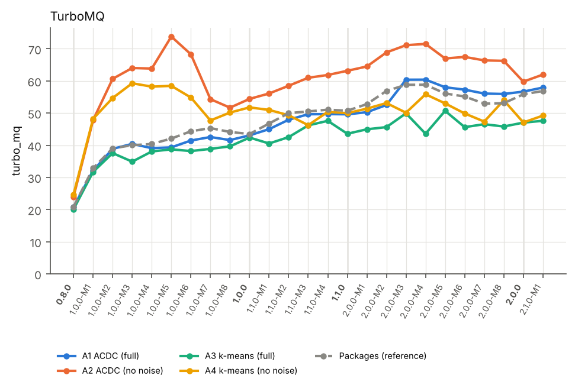

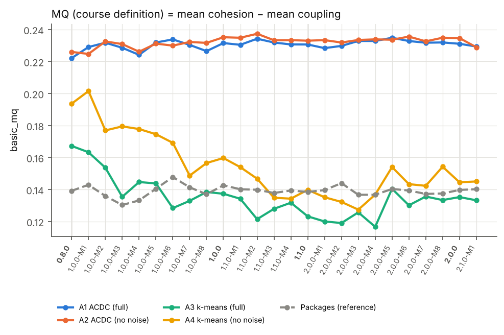
